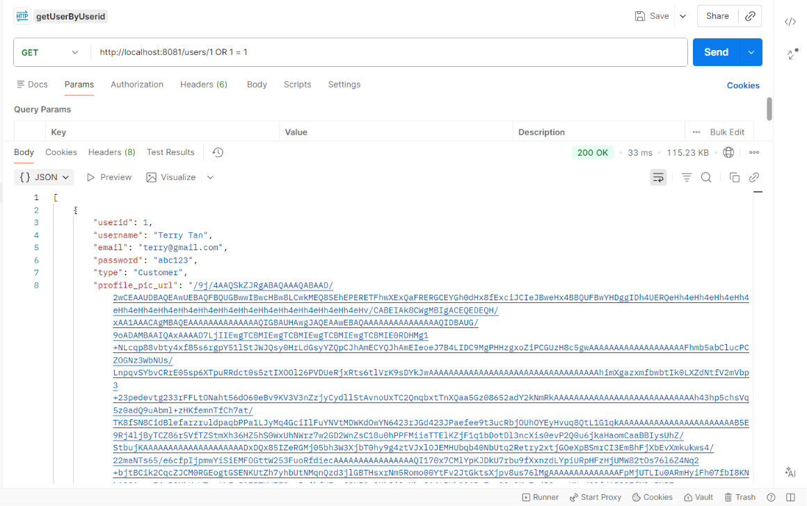
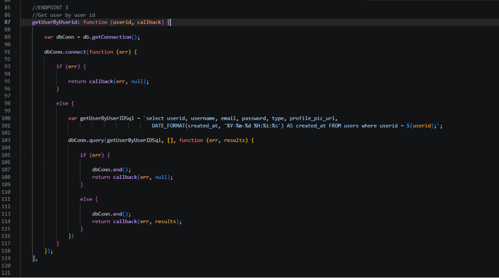
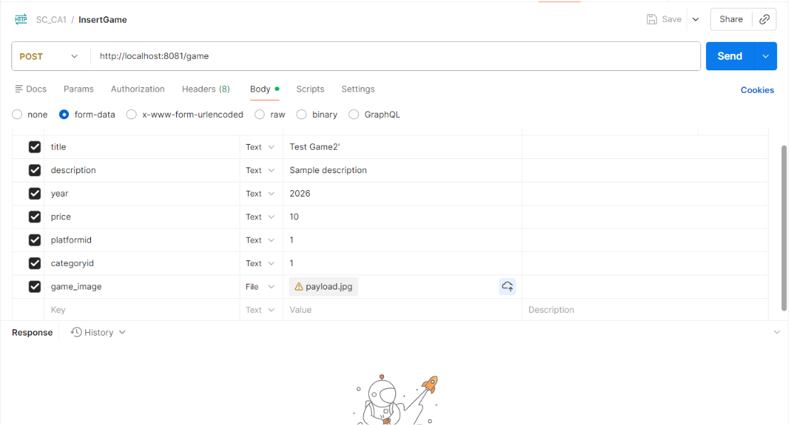
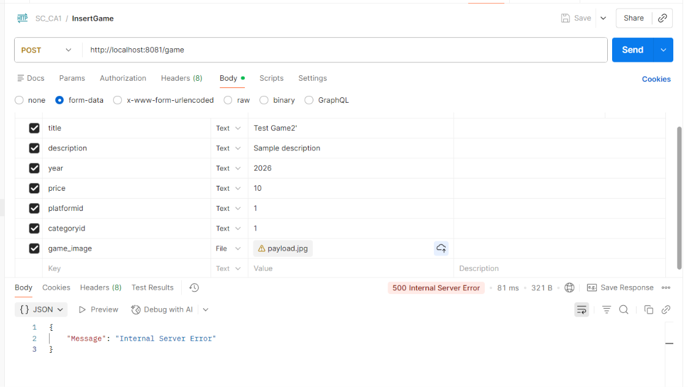
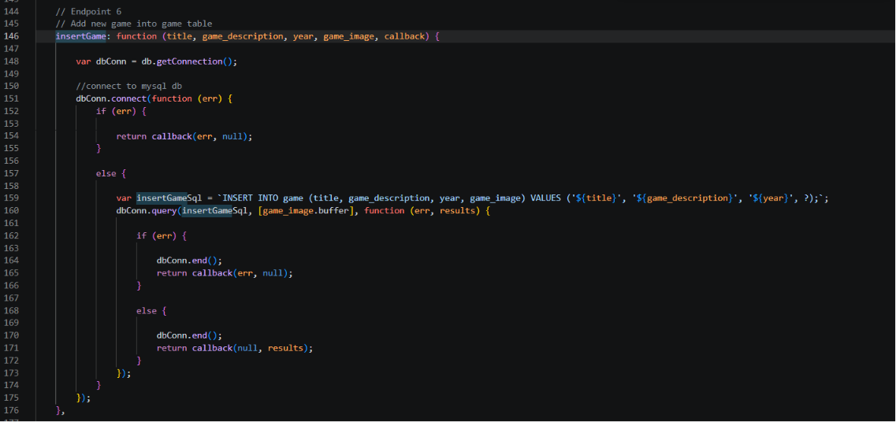

# Vulnerability Analysis Report - OWASP A03 Injection

## Executive Summary

This report covers SQL Injection weaknesses in the `turbo-funicular` game catalogue application. The backend uses Node.js, Express, and MySQL, and the vulnerable code appears in the model layer where request data is copied directly into SQL strings. The two main injection sinks are `getUserByUserid` and `insertGame`, with `updateGame()` included as a third code-level sink because it uses the same unsafe pattern.

The core issue is the same across all three locations: the application trusts raw user input and embeds it into SQL text instead of separating code from data. That design makes it possible for an attacker to alter a query, leak more data than intended, or trigger server errors.

---

## Finding 1 - SQL Injection in `GET /users/:userid`

### 1. Vulnerability & Type of Flaw

**Type:** OWASP A03 - Injection / SQL Injection

The `GET /users/:userid` route reads `userid` from the URL and passes it into `userDB.getUserByUserid()` without validation or parameterization. In the model layer, that value is concatenated directly into the `WHERE` clause of the SQL statement.

This is a classic SQL Injection sink because the database engine cannot distinguish between the intended numeric identifier and attacker-supplied SQL syntax. The query also selects the `password` column, which means a successful injection can expose sensitive account data in the response.

### 2. Exploitation

The easiest proof-of-concept is to replace the expected numeric ID with a payload that changes the query logic:

```http
GET /users/1 OR 1 = 1
```

If the backend accepts the payload as part of the SQL expression, the `WHERE` clause becomes broader than intended. Instead of returning only one user row, the query can return multiple user records.

That is dangerous for two reasons:

- the attacker can enumerate user data they were never meant to see
- the response can include `password`, `email`, and other profile fields

Relevant screenshots:





### 3. Database Storage

The affected data is stored in the `users` table.

Relevant columns:

- `userid`
- `username`
- `email`
- `password`
- `type`
- `profile_pic_url`
- `created_at`

The report is especially concerned with `password`, because the vulnerable query selects it directly. Even if the database itself is not compromised, exposing the field through the API creates a major confidentiality issue.

### 4. Affected Code (with Location)

**File:** `Assignment/BackEndServer/controller/app.js`

```javascript
app.get('/users/:userid', function (req, res) {
    var userid = req.params.userid;
    userDB.getUserByUserid(userid, function (err, results) {
        ...
    });
});
```

**File:** `Assignment/BackEndServer/model/users.js`

```javascript
var getUserByUserIDSql = `select userid, username, email, password, type, profile_pic_url,
                            DATE_FORMAT(created_at, '%Y-%m-%d %H:%i:%s') AS created_at FROM users where userid = ${userid};`;
```

Line range to cite in the report:

- controller route: `Assignment/BackEndServer/controller/app.js:308-314`
- model sink: `Assignment/BackEndServer/model/users.js:87-103`

### 5. Recommendations & Fix Code

The fix is to use a parameterized query and remove the password field from the response unless the endpoint explicitly needs it.

Recommended pattern:

```javascript
var getUserByUserIDSql = `
    SELECT userid, username, email, type, profile_pic_url,
           DATE_FORMAT(created_at, '%Y-%m-%d %H:%i:%s') AS created_at
    FROM users
    WHERE userid = ?;
`;

dbConn.query(getUserByUserIDSql, [userid], function (err, results) {
    ...
});
```

This matters because `?` tells MySQL to treat the incoming value as data, not as part of the SQL grammar.

### 6. Testing Process

Before the fix:

- Send `GET /users/1 OR 1 = 1`
- Observe whether the API returns more rows than a single user
- Check whether the response includes sensitive fields like `password`

After the fix:

- The same input should no longer change the query structure
- The backend should either return no match, validate the ID, or reject the request as invalid

### 7. Tools Used

| Tool | Purpose |
|------|---------|
| Manual code review | Identified the unsafe query construction |
| Bruno / API request tool | Captured the proof-of-concept request and response |
| VS Code | Located the route and model sink |

---

## Finding 2 - SQL Injection in `POST /game`

### 1. Vulnerability & Type of Flaw

**Type:** OWASP A03 - Injection / SQL Injection

The `POST /game` route receives form data for the game title, description, year, price, platform, category, and image. The controller forwards the title, description, and year into `insertGame()`, and the model builds the SQL statement with string interpolation.

The vulnerable part is the use of `${title}`, `${game_description}`, and `${year}` inside the `INSERT` query. Once a quote character or SQL fragment enters one of those fields, the query can break or be altered.

### 2. Exploitation

An attacker can submit a crafted game creation request using a quote in `title` or `description`. Even if the request is not meant to execute a second statement, it can still break the `INSERT` syntax and trigger a server error.

Example idea:

- set `title` to `Test Game2'`
- keep the rest of the fields valid
- send the normal `POST /game` request

If the SQL is unsafe, the backend may respond with a `500 Internal Server Error` because the query string is no longer valid SQL.

Relevant screenshots:







### 3. Database Storage

The main row is stored in the `game` table.

The write flow also inserts into:

- `game_platform`
- `game_category`

This means one unsafe game create request can affect multiple tables. Even though the first query is the injection sink, the rest of the write flow depends on the first insert succeeding, so a broken query can leave the application in an incomplete or inconsistent state.

### 4. Affected Code (with Location)

**File:** `Assignment/BackEndServer/controller/app.js`

```javascript
app.post('/game', upload.single('game_image'), function (req, res) {
    var title = req.body.title;
    var game_description = req.body.description;
    var year = req.body.year;
    var game_image = req.file;

    gameDB.insertGame(title, game_description, year, game_image, function (err, results) {
        ...
    });
});
```

**File:** `Assignment/BackEndServer/model/game.js`

```javascript
var insertGameSql = `INSERT INTO game (title, game_description, year, game_image) VALUES ('${title}', '${game_description}', '${year}', ?);`;
```

Line range to cite in the report:

- controller route: `Assignment/BackEndServer/controller/app.js:435-471`
- model sink: `Assignment/BackEndServer/model/game.js:153-160`

### 5. Recommendations & Fix Code

The fix is to parameterize the entire insert and keep the image as a bound value rather than building it into the SQL string.

Recommended pattern:

```javascript
var insertGameSql = `
    INSERT INTO game (title, game_description, year, game_image)
    VALUES (?, ?, ?, ?)
`;

dbConn.query(insertGameSql, [title, game_description, year, game_image.buffer], function (err, results) {
    ...
});
```

Additional hardening:

- validate `year` as a number
- reject empty or unusually long titles and descriptions
- ensure `game_image` exists before reading `.buffer`

### 6. Testing Process

Before the fix:

- send a `POST /game` request with a quoted title such as `Test Game2'`
- observe whether the backend returns `500`
- check whether the console or response reveals an SQL error

After the fix:

- the same request should no longer change the SQL structure
- the backend should either insert safely or reject invalid input before the query runs

### 7. Tools Used

| Tool | Purpose |
|------|---------|
| Manual code review | Located the interpolated `INSERT` query |
| Bruno / API request tool | Triggered the failing game creation request |
| VS Code | Cross-checked the controller and model paths |

---

## Finding 3 - SQL Injection in `updateGame()`

### 1. Vulnerability & Type of Flaw

**Type:** OWASP A03 - Injection / SQL Injection

The `updateGame()` helper in `model/game.js` uses the same unsafe pattern as `insertGame()`. It places `title`, `game_description`, `year`, `game_image.buffer`, and `gameID` directly into the SQL text.

I did not find a direct public route calling this helper in `controller/app.js`, so this is best described as a code-level vulnerability rather than a confirmed live-route exploit. Even so, it should still be reported because it is ready to become exploitable if a route is added later or if an existing route is refactored to use it.

### 2. Exploitation

There is no direct HTTP path to this helper in the current controller, so the exploit here is a code-path risk rather than a live request.

If a future route passes raw request data into this helper, an attacker could inject SQL through:

- `title`
- `game_description`
- `year`
- `gameID`

Because the `WHERE` clause also interpolates `gameID`, the update could affect the wrong row or become broader than intended.

### 3. Database Storage

The affected data is stored in the `game` table.

Relevant columns:

- `title`
- `game_description`
- `year`
- `game_image`
- `gameID`

This helper directly modifies existing game records, so a successful injection could damage content integrity as well as availability.

### 4. Affected Code (with Location)

**File:** `Assignment/BackEndServer/model/game.js`

```javascript
var updateGameSql = `update game set title='${title}', game_description='${game_description}', year='${year}', game_image='${game_image.buffer}' where gameID='${gameID}`;
```

Line range to cite in the report:

- model sink: `Assignment/BackEndServer/model/game.js:293-306`

### 5. Recommendations & Fix Code

The fix is to parameterize every field, including the record identifier in the `WHERE` clause.

Recommended pattern:

```javascript
var updateGameSql = `
    UPDATE game
    SET title = ?, game_description = ?, year = ?, game_image = ?
    WHERE gameID = ?
`;

dbConn.query(updateGameSql, [title, game_description, year, game_image.buffer, gameID], function (err, results) {
    ...
});
```

This closes the injection sink and also makes the update logic easier to read and maintain.

### 6. Testing Process

Before the fix:

- inspect the helper code and confirm it uses string interpolation
- verify that `gameID` is inserted directly into the SQL string

After the fix:

- confirm the query uses `?` placeholders only
- ensure the helper still updates the intended row when called with valid data

### 7. Tools Used

| Tool | Purpose |
|------|---------|
| Manual code review | Found the unsafe update helper |
| Source search | Checked whether any controller route calls it directly |

---

## Conclusion

| Finding | Category | Severity |
|---------|----------|----------|
| 1 - SQL Injection in `GET /users/:userid` | A03 | High |
| 2 - SQL Injection in `POST /game` | A03 | High |
| 3 - SQL Injection in `updateGame()` | A03 | Medium |

The shared root cause is unsafe SQL construction with direct string interpolation. The correct fix is to use parameterized queries, validate inputs before they reach the model layer, and avoid returning unnecessary sensitive fields such as `password`.

The first two findings are confirmed by live request flow and screenshots. The third is a code-level sink that should still be fixed because it can become exploitable if reused in a route later.
