# Vulnerability Analysis Report — OWASP A01 & A09

## Executive Summary

This report documents a security assessment of a game catalogue web application. The assessment identified **five critical/high-severity vulnerabilities** across OWASP Top 10 2021 categories A01 (Broken Access Control) and A09 (Security Logging & Monitoring Failures). The combined impact of these findings is **critical**: an unauthenticated attacker can:

- Create admin-privileged accounts and perform any action (create/delete games, access user data, post reviews as any user)
- Access the complete user database including plaintext passwords
- Inject arbitrary SQL commands to modify or delete database records
- Forge authentication tokens with admin privileges
- Perform all actions without leaving any audit trail for detection or forensic analysis

**Overall Risk Assessment:** The application is **unsuitable for production use** until all critical findings are remediated and password hashing, audit logging, and secrets management are implemented.

---

## Assessment Methodology

The application consists of an Express.js backend (port 8081), a Node.js frontend server, and a MySQL database. Each finding below follows the same seven-part structure: (1) vulnerability description & type of flaw, (2) exploitation steps with proof of concept, (3) database storage context, (4) affected code location, (5) recommendations & fix code, (6) testing process, and (7) tools used.

**Note on Screenshots:** Image references throughout this report point to `Assignment/Assets/Nachiketh/`. These assets should be collected via API testing tools (Bruno, curl, browser Developer Tools) and organized in this directory before final submission. Placeholder paths are included to show where evidence should be inserted.

---

## Finding 1 — Missing Authentication & Authorisation on API Endpoints

### 1. Vulnerability & Type of Flaw

**Type:** A01 — Broken Access Control (Missing Authentication & Authorisation)

**CVSS 3.1 Score:** 9.8 (Critical)  
**CVSS Vector:** `CVSS:3.1/AV:N/AC:L/PR:N/UI:N/S:U/C:H/I:H/A:H`  
(Network-accessible, low attack complexity, no privileges required, no user interaction, complete confidentiality/integrity/availability impact)

The backend controller (`controller/app.js`) registers numerous endpoints that handle sensitive operations (user management, game CRUD, category/platform administration) **without** any authentication middleware. Only a single endpoint (`/CheckRole`) uses the `verifyToken` middleware, and even that endpoint does not enforce role-based restrictions. No server-side role check exists anywhere in the application.

### 2. Exploitation

**Step 1 — Discover unprotected endpoints via API enumeration**

Using Bruno API Client, I enumerated the available endpoints from the collection (`API-Testing/opencollection.yml`). The majority of endpoints had no `Authorization` header requirement.

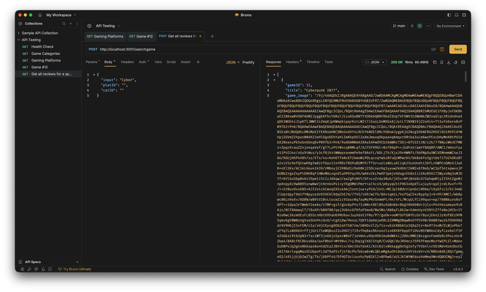

**Step 2 — Create an admin account without authentication**

Since `POST /users` accepts a `type` field from the client with no validation, I sent a request to `POST http://localhost:8081/users` with the following JSON body:

```json
{
  "username": "hacker_admin",
  "email": "hacker@example.com",
  "password": "pwned123",
  "type": "admin"
}
```

The server responded with `201 Created`, confirming the admin account was created without any authentication or authorisation.

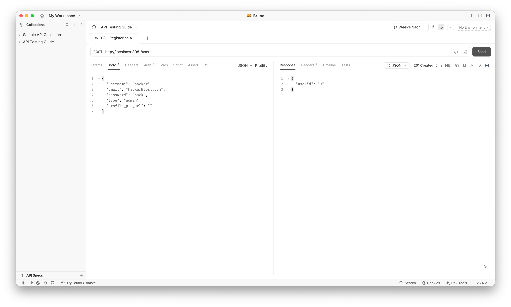

**Step 3 — Delete a game without authentication**

A `DELETE` request to `http://localhost:8081/game/14` with no `Authorization` header returned `204 No Content`, removing a game from the database with zero access control.


**Step 4 — Bypass client-side admin check in the frontend**

The admin dashboard (`admin.html`) implements access control entirely on the client side — it merely applies a CSS `locked` class (opacity 0.6) when the user is not an admin. An attacker can trivially bypass this by removing the class via browser Developer Tools.

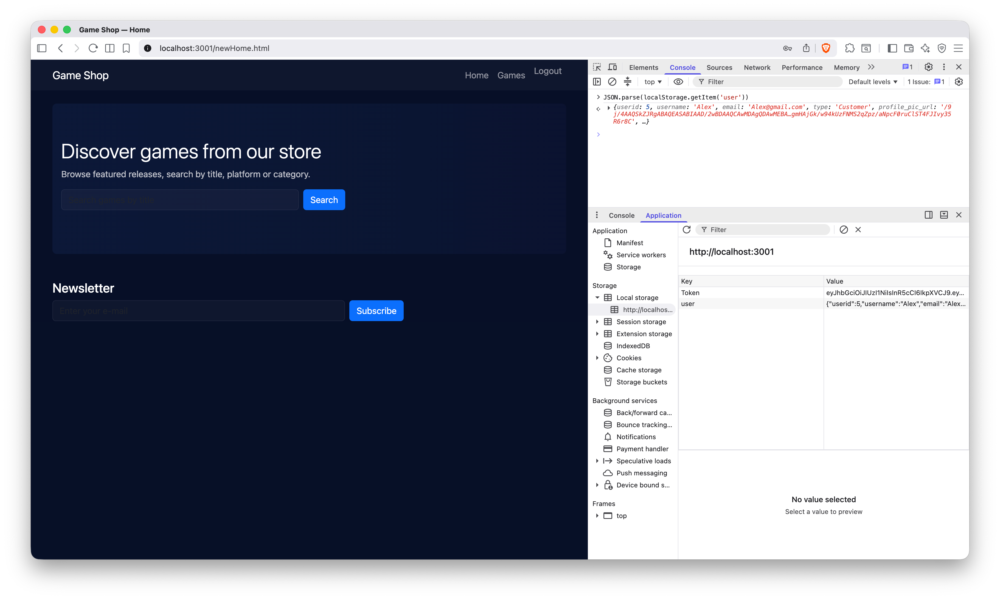

### 3. Database Storage

The application uses MySQL with the following relevant tables:

- **`users`** — `userid`, `username`, `email`, `password`, `type`, `profile_pic_url`, `created_at`
- **`game`** — `gameID`, `title`, `game_description`, `year`, `game_image`
- **`category`** — `catid`, `catname`, `cat_description`
- **`platform`** — `pid`, `platform_name`, `platform_description`

All tables are accessible through unprotected endpoints. An attacker can create, read, update, or delete any record in any table without authentication.

### 4. Affected Code (with Location)

The following endpoints in `Assignment/BackEndServer/controller/app.js` were registered without authentication:

| Endpoint | File Lines | Purpose |
|----------|-----------|---------|
| `GET /users` | 219–241 | List all users (including passwords) |
| `POST /users` | 244–302 | Register new user (client-supplied role) |
| `GET /users/:userid` | 305–331 | Get single user by ID |
| `POST /category` | 334–381 | Create category |
| `POST /platform` | 384–429 | Create platform |
| `POST /game` | 432–495 | Create game |
| `DELETE /game/:id` | 526–551 | Delete game |
| `POST /users/:uid/game/:gid/review` | 554–582 | Post review (no user verification) |
| Login error handler | 123–153 | Leaks raw error objects to client |
| `console.log(result)` | 134 | Logs entire user object including passwords |

*Vulnerable example — `GET /users` (line 219):*

```javascript
app.get('/users', function (req, res) {
    userDB.getUser(function (err, results) {
        if (err) { /* ... */ }
        else { res.send(results); }
    });
});
```

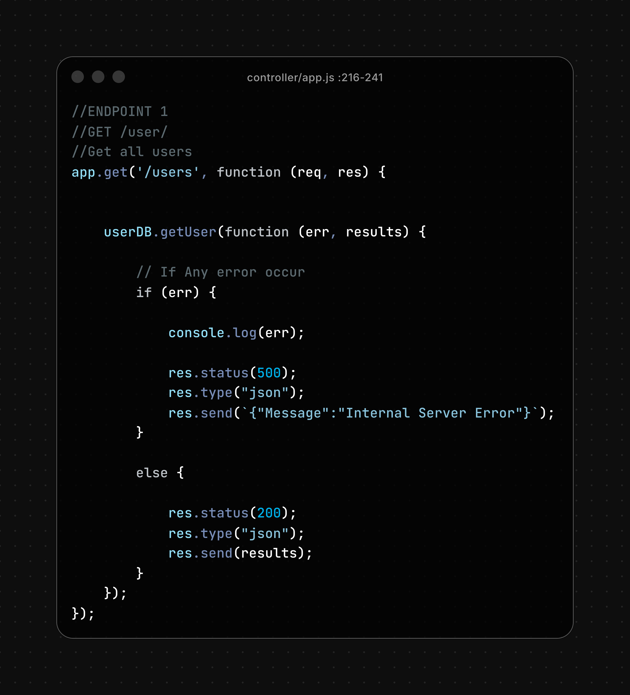

*Vulnerable example — `POST /users` (line 244):*

```javascript
app.post('/users', function (req, res) {
    var type = req.body.type;   // client can set ANY role
    userDB.insertUser(username, email, password, type, ...);
});
```


*Remaining vulnerable endpoints:*


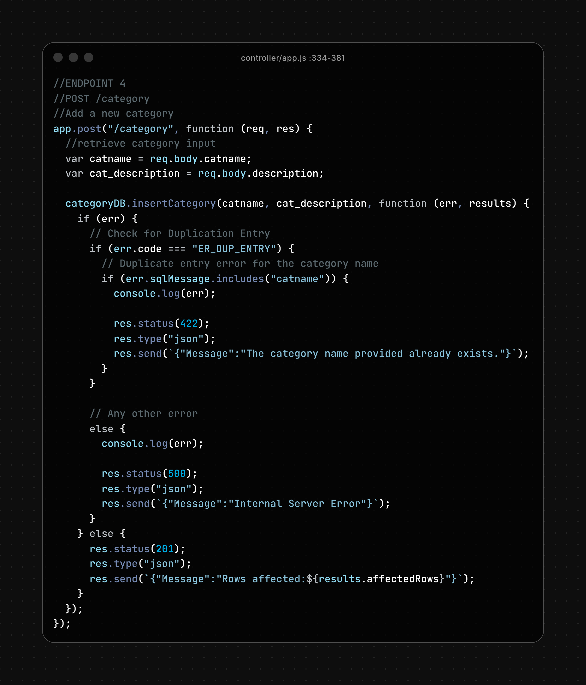

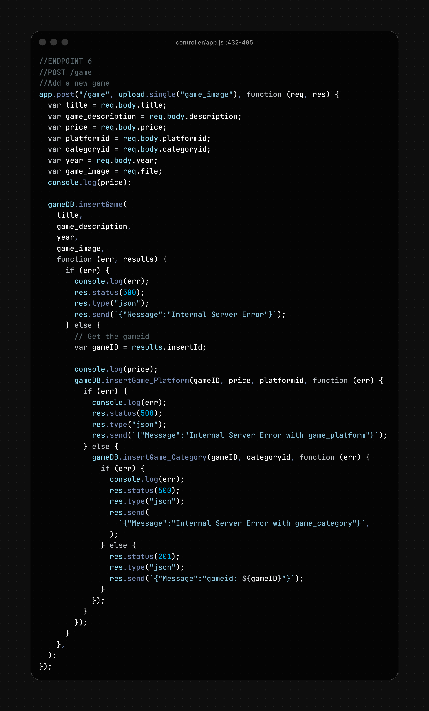

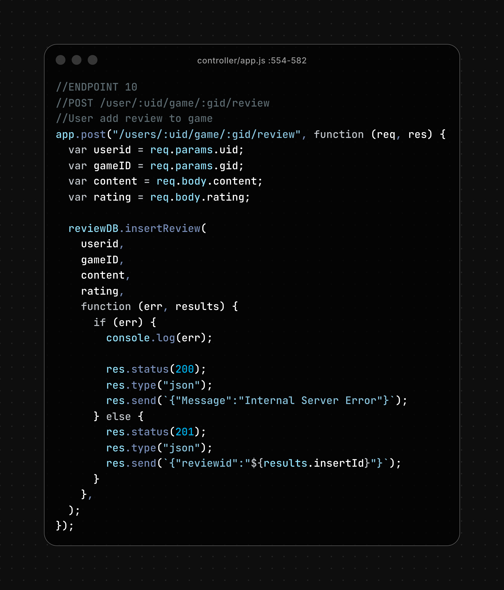


### 5. Recommendations & Fix Code

**Fix 1 — Create `requireAdmin` middleware (`auth/requireAdmin.js`):**

```javascript
function requireAdmin(req, res, next) {
    if (req.type !== 'admin') {
        res.status(403);
        return res.json({ auth: false, message: 'Admin access required!' });
    }
    next();
}
module.exports = requireAdmin;
```

**Fix 2 — Add `verifyToken` and `requireAdmin` to all protected endpoints in `controller/app.js`:**

```javascript
// Import added at line 15:
var requireAdmin = require('../auth/requireAdmin.js');

// GET /users — now requires admin auth
app.get('/users', verifyToken, requireAdmin, function (req, res) { /* ... */ });

// POST /users — requires admin, type hardcoded to 'user'
app.post('/users', verifyToken, requireAdmin, function (req, res) {
    var type = 'user';    // never trust client input
    /* ... */
});

// GET /users/:userid
app.get('/users/:userid', verifyToken, requireAdmin, function (req, res) { /* ... */ });

// POST /category, POST /platform
app.post('/category', verifyToken, requireAdmin, function (req, res) { /* ... */ });
app.post('/platform', verifyToken, requireAdmin, function (req, res) { /* ... */ });

// POST /game — requireAdmin before upload middleware
app.post('/game', verifyToken, requireAdmin, upload.single('game_image'), function (req, res) { /* ... */ });

// DELETE /game/:id
app.delete('/game/:id', verifyToken, requireAdmin, function (req, res) { /* ... */ });

// POST review — any authenticated user may post
app.post('/users/:uid/game/:gid/review', verifyToken, function (req, res) { /* ... */ });

// Login error — generic message instead of raw error
// Before:
res.send(err.statusCode);
// After:
res.json({ success: false, message: 'Login failed' });

// Comment out leaky console.log(result)
// console.log(result);
```

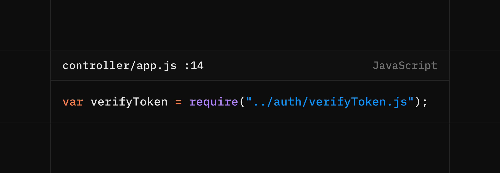

### 6. Testing Process

**Before fix:** Send requests to any protected endpoint without an `Authorization` header. The server returns `200 OK` or `201 Created` for all operations. Creating an account with `type: "admin"` succeeds.

**After fix:** Send the same requests without a token — the server returns `403 Forbidden` with `{"auth":false,"message":"Not authorized!"}`. Send with a non-admin token — returns `403 Forbidden` with `{"auth":false,"message":"Admin access required!"}`. Only requests with a valid admin JWT succeed.

### 7. Tools Used

| Tool | Purpose |
|------|---------|
| **Bruno API Client** | Crafted and sent requests to each endpoint with and without authentication |
| **Browser Developer Tools** | Inspected DOM, removed CSS `locked` class to bypass client-side admin check |
| **curl** | Quick verification of endpoint accessibility |
| **VS Code** | Source code review to identify unprotected endpoints |

---

## Finding 2 — User Data Exposure with Plaintext Passwords

### 1. Vulnerability & Type of Flaw

**Type:** A01 — Broken Access Control (Insecure Direct Object Reference / Mass Assignment)

**CVSS 3.1 Score:** 9.1 (Critical)  
**CVSS Vector:** `CVSS:3.1/AV:N/AC:L/PR:N/UI:N/S:U/C:H/I:H/A:N`  
(Network-accessible, low attack complexity, no privileges required, no user interaction, complete confidentiality/integrity impact)

The `GET /users` endpoint returns all user records — including the `password` column — to anyone who makes a request, with no authentication required. Passwords are stored and transmitted in **plaintext** with no hashing.

### 2. Exploitation

**Step 1 — Fetch all user data including passwords**

Send a `GET` request to `http://localhost:8081/users`. The response contains every user's `userid`, `username`, `email`, `password`, `type`, `profile_pic_url`, and `created_at` in plaintext JSON.

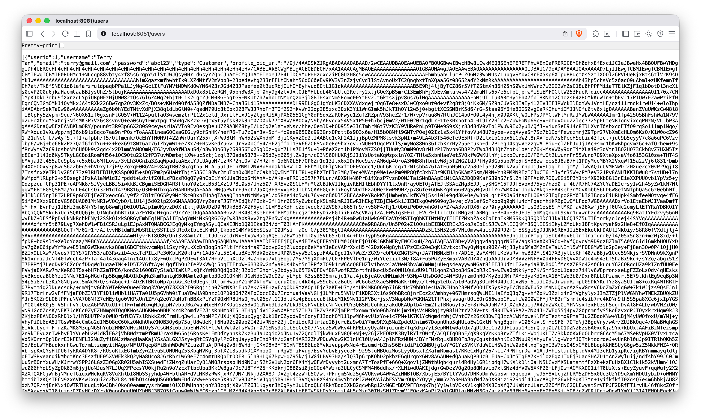

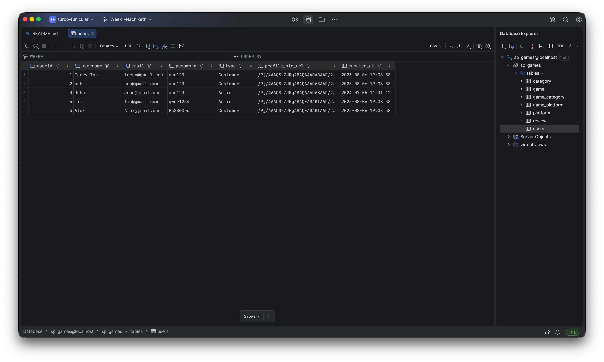

**Step 2 — Login as any exposed user**

Take any email/password pair from the exposed list (e.g., Alex's credentials) and log in via `POST /users/login`. The server returns a valid JWT, granting full access as that user.

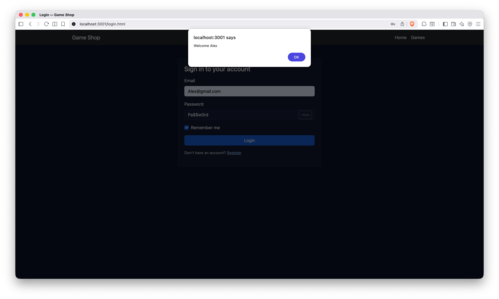

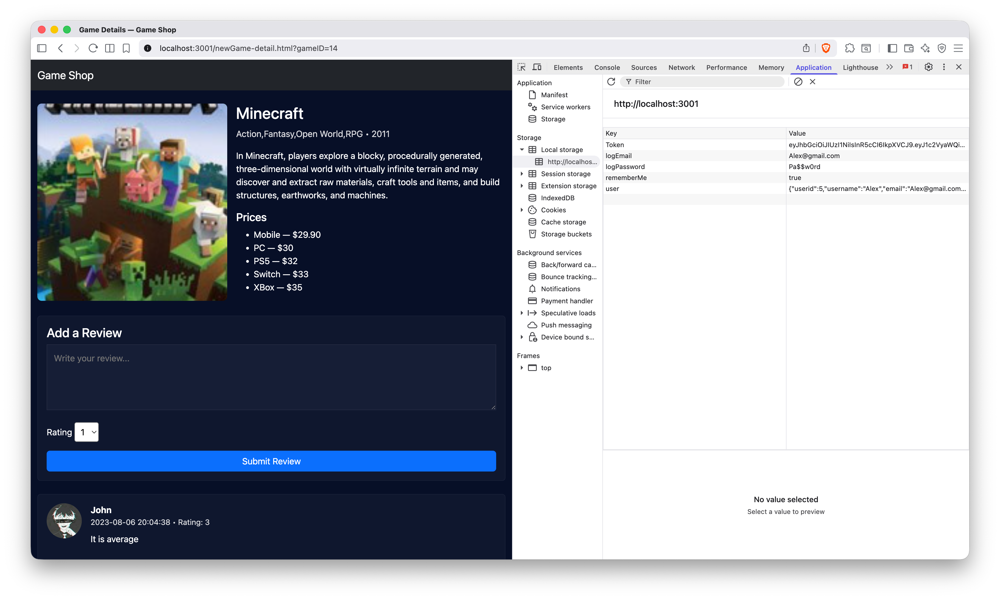

### 3. Database Storage

The `users` table stores the `password` column in plaintext. The schema is:

```sql
CREATE TABLE users (
    userid INT PRIMARY KEY AUTO_INCREMENT,
    username VARCHAR(255),
    email VARCHAR(255),
    password VARCHAR(255),   -- plaintext, NOT hashed
    type VARCHAR(50),
    profile_pic_url TEXT,
    created_at DATETIME DEFAULT CURRENT_TIMESTAMP
);
```

Passwords are inserted and compared directly as strings with no hashing, salting, or encryption.

### 4. Affected Code (with Location)

**`controller/app.js` lines 219–241** — Unauthenticated `GET /users` endpoint:

```javascript
app.get('/users', function (req, res) {
    userDB.getUser(function (err, results) {
        if (err) {
            res.status(500);
            res.type("json");
            res.send(`{"Message":"Internal Server Error"}`);
        } else {
            res.status(200);
            res.type("json");
            res.send(results);   // sends ALL fields including password
        }
    });
});
```


**`model/users.js` line 28** — SQL query selects `password` column:

```javascript
var getUserSql = `select userid, username, email, password, type, profile_pic_url,
                    DATE_FORMAT(created_at, '%Y-%m-%d %H:%i:%s') AS created_at FROM users`;
```

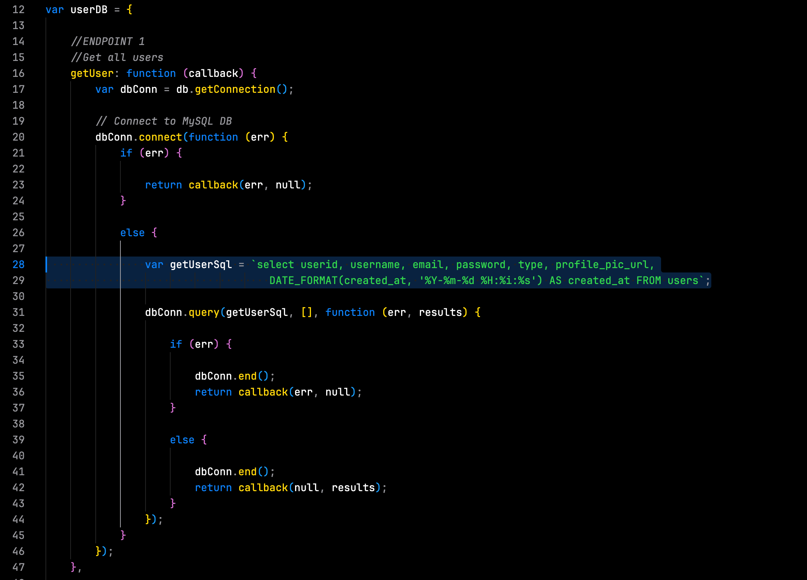

### 5. Recommendations & Fix Code

**Fix 1 — Remove `password` from SELECT in `model/users.js`:**

```javascript
var getUserSql = `select userid, username, email, type, profile_pic_url,
                    DATE_FORMAT(created_at, '%Y-%m-%d %H:%i:%s') AS created_at FROM users`;
```

**Fix 2 — Add `verifyToken` + `requireAdmin` to `GET /users` in `controller/app.js`:**

```javascript
app.get('/users', verifyToken, requireAdmin, function (req, res) { /* ... */ });
```

**Fix 3 (fundamental) — Hash passwords with bcrypt before storage and during login verification.** The `insertUser` and login functions should use `bcrypt.hash()` and `bcrypt.compare()` respectively. This is not yet implemented in the current fix set but is the critical long-term solution.

### 6. Testing Process

**Before fix:** Send `GET http://localhost:8081/users` with no headers. The response is a JSON array containing all users with their plaintext passwords. Copy any email/password pair, send `POST /users/login` with those credentials, and receive a valid JWT.

**After fix:** Send `GET http://localhost:8081/users` with no token — returns `403 Forbidden`. Send with a non-admin token — returns `403 Forbidden` (admin required). Send with an admin token — returns user list **without** the `password` field.

### 7. Tools Used

| Tool | Purpose |
|------|---------|
| **curl** | Fetched user data and logged in using exposed credentials |
| **Bruno API Client** | Structured request/response testing |
| **VS Code** | Code review to trace the data flow from SQL query to HTTP response |

---

## Finding 3 — SQL Injection in Database Queries

### 1. Vulnerability & Type of Flaw

**Type:** A03 — Injection (SQL Injection)  
**Related to A01:** Broken Access Control (gains unauthorized data access)

**CVSS 3.1 Score:** 9.8 (Critical)  
**CVSS Vector:** `CVSS:3.1/AV:N/AC:L/PR:N/UI:N/S:U/C:H/I:H/A:H`  
(Network-accessible, low attack complexity, no privileges required, no user interaction, complete confidentiality/integrity/availability impact)

Three database queries in the model layer build SQL strings using template literal interpolation (`${...}`) instead of parameterised placeholders (`?`). This allows an attacker to inject arbitrary SQL commands via user-controlled input fields.

### 2. Exploitation

**Step 1 — SQL injection via game title in `POST /game`**

The `insertGame` query in `model/game.js` interpolates `title`, `game_description`, and `year` directly. An attacker sends:

```
POST /game HTTP/1.1
Content-Type: multipart/form-data

title='); DROP TABLE game; --
```

The resulting query becomes:
```sql
INSERT INTO game (title, game_description, year, game_image) VALUES (''); DROP TABLE game; --', '...', '...', ?);
```

This would delete the `game` table entirely.

**Step 2 — SQL injection via user ID in `GET /users/:userid`**

The `getUserByUserid` query in `model/users.js` interpolates `userid` directly:

```
GET /users/1 OR 1=1
```

The resulting query:
```sql
SELECT ... FROM users WHERE userid = 1 OR 1=1;
```

This returns all users instead of a single user.

**Step 3 — SQL injection via update fields in `POST /game/:id`**

The `updateGame` query interpolates all fields and has a syntax error (missing closing quote around `gameID`):

```javascript
`update game set title='${title}', ... where gameID='${gameID}`
```

The missing quote means the query would always produce a syntax error under normal use, making it entirely non-functional as well as vulnerable.

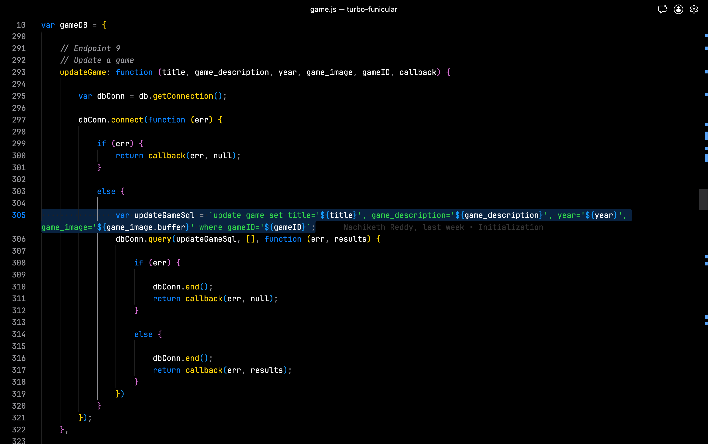

### 3. Database Storage

The MySQL database executes queries directly against the `users` and `game` tables. When template literals are used, the database driver receives a fully-formed SQL string with no parameter separation — the attacker's input is indistinguishable from the query structure itself.

### 4. Affected Code (with Location)

**`model/users.js` lines 100–103** — SQLi in `getUserByUserid`:

```javascript
var getUserByUserIDSql = `select userid, username, email, password, type, profile_pic_url,
                            DATE_FORMAT(created_at, '%Y-%m-%d %H:%i:%s') AS created_at FROM users where userid = ${userid};`;

dbConn.query(getUserByUserIDSql, [], function (err, results) {
```

Issues: `${userid}` is interpolated directly, empty `[]` parameter array, `password` column selected.

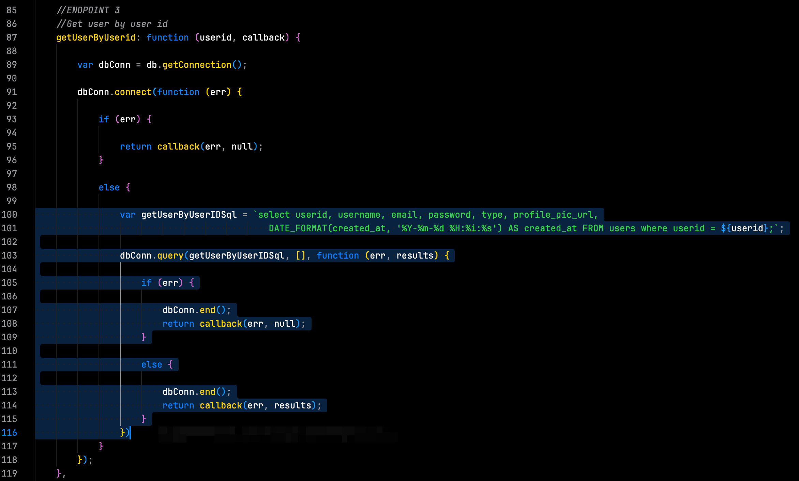

**`model/game.js` lines 157–160** — SQLi in `insertGame`:

```javascript
var insertGameSql = `INSERT INTO game (title, game_description, year, game_image) VALUES ('${title}', '${game_description}', '${year}', ?);`;
dbConn.query(insertGameSql, [game_image.buffer], function (err, results) {
```

Issues: Three fields interpolated, only `game_image.buffer` is a proper parameter.

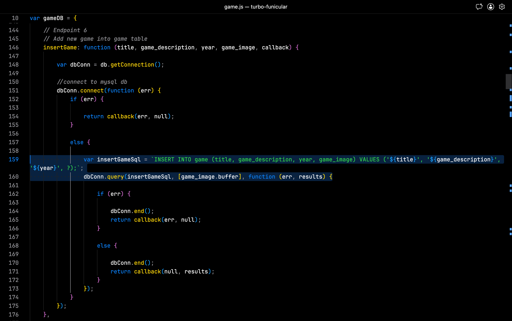

**`model/game.js` lines 303–306** — SQLi in `updateGame`:

```javascript
var updateGameSql = `update game set title='${title}', game_description='${game_description}', year='${year}', game_image='${game_image.buffer}' where gameID='${gameID}`;
dbConn.query(updateGameSql, [], function (err, results) {
```

Issues: All fields interpolated, missing closing quote on `${gameID}`, binary `game_image.buffer` coerced to string, empty parameter array.


### 5. Recommendations & Fix Code

All three queries must use parameterised statements. Template literal interpolation (`${...}`) should never appear inside SQL strings.

**Fix — `model/users.js` lines 100–103:**

```javascript
var getUserByUserIDSql = `select userid, username, email, type, profile_pic_url,
                            DATE_FORMAT(created_at, '%Y-%m-%d %H:%i:%s') AS created_at FROM users where userid = ?;`;

dbConn.query(getUserByUserIDSql, [userid], function (err, results) {
```

**Fix — `model/game.js` lines 157–160:**

```javascript
var insertGameSql = `INSERT INTO game (title, game_description, year, game_image) VALUES (?, ?, ?, ?);`;
dbConn.query(insertGameSql, [title, game_description, year, game_image.buffer], function (err, results) {
```

**Fix — `model/game.js` lines 303–306:**

```javascript
var updateGameSql = `UPDATE game SET title=?, game_description=?, year=?, game_image=? WHERE gameID=?;`;
dbConn.query(updateGameSql, [title, game_description, year, game_image.buffer, gameID], function (err, results) {
```

### 6. Testing Process

**Before fix:** Send requests with SQL injection payloads. For `GET /users/1 OR 1=1`, the server returns all users. For `POST /game` with a crafted title containing a single quote, the server either executes the injected SQL or returns a database error revealing the query structure.

**After fix:** Send the same payloads. The parameterised query treats the input as a literal string — `1 OR 1=1` becomes the literal value for `userid` (no match found), and `'); DROP TABLE game; --` becomes a literal game title string (no injection occurs).

### 7. Tools Used

| Tool | Purpose |
|------|---------|
| **Bruno API Client** | Crafted requests with SQL injection payloads |
| **curl** | Command-line testing with URL-encoded payloads |
| **VS Code** | Source code audit to identify all interpolation points |

---

## Finding 4 — Hardcoded JWT Signing Secret

### 1. Vulnerability & Type of Flaw

**Type:** A01 — Broken Access Control (Cryptographic Weakness / Secrets in Source Code)

**CVSS 3.1 Score:** 7.5 (High)  
**CVSS Vector:** `CVSS:3.1/AV:N/AC:L/PR:N/UI:N/S:U/C:H/I:H/A:N`  
(Network-accessible, low attack complexity, no privileges required, no user interaction, high confidentiality/integrity impact, no availability impact)

The JWT signing secret is hardcoded as `'Assignment2key'` in `config.js`. Anyone with access to the source code (including all developers, anyone who can read the repository, or anyone who finds the file via path traversal) can forge valid JWTs with arbitrary claims — including setting `type: "admin"`.

### 2. Exploitation

**Step 1 — Read the secret from `config.js`:**

```javascript
var secret='Assignment2key'; //your own secret key
```

**Step 2 — Forge an admin JWT:**

Using Node.js or any JWT library, create a token with admin privileges:

```javascript
var jwt = require('jsonwebtoken');
var forgedToken = jwt.sign(
    { userid: 999, type: 'admin' },
    'Assignment2key',
    { expiresIn: 86400 }
);
```

**Step 3 — Use the forged token:**

Include `Authorization: Bearer <forged_token>` in requests to any protected endpoint. The `verifyToken` middleware decodes the token using the same hardcoded secret, validates the signature, and populates `req.type = 'admin'`. The `requireAdmin` middleware then passes the request, granting full administrative access.


### 3. Database Storage

This vulnerability does not involve database storage. The JWT secret is a configuration value used at the application layer to sign and verify JSON Web Tokens.

### 4. Affected Code (with Location)

**`Assignment/BackEndServer/config.js`:**

```javascript
var secret='Assignment2key'; //your own secret key
module.exports.key = secret;
```

This file is imported by `auth/verifyToken.js` and used by `jsonwebtoken.sign()` and `jsonwebtoken.verify()` calls throughout the application.

### 5. Recommendations & Fix Code

**Fix — load secret from environment variable with a startup guard:**

```javascript
var secret = process.env.JWT_SECRET;
if (!secret) {
    console.error('FATAL: JWT_SECRET environment variable is not set.');
    process.exit(1);
}
module.exports.key = secret;
```

The server will refuse to start if `JWT_SECRET` is not set in the environment, preventing accidental deployment with a weak or exposed secret. In production, this value should be managed through a secrets manager or environment-specific configuration (`.env` files, CI/CD secrets, cloud secrets manager).

### 6. Testing Process

**Before fix:** Run `node -e "const jwt=require('jsonwebtoken'); console.log(jwt.sign({userid:1,type:'admin'},'Assignment2key'));"` to generate a forged token. Use this token to access `DELETE /game/1` — the server accepts it and deletes the game.

**After fix:** Attempt the same forgery. The server uses `process.env.JWT_SECRET` which is different from `'Assignment2key'`. The forged token's signature verification fails, returning `403 Forbidden`. To test successfully, you must know the actual `JWT_SECRET` environment variable value.

### 7. Tools Used

| Tool | Purpose |
|------|---------|
| **Node.js** | Generated forged JWTs with the hardcoded secret |
| **Bruno API Client** | Sent requests with forged tokens to verify acceptance |
| **VS Code** | Identified the hardcoded secret in source code |

---

## Finding 5 — Security Logging & Monitoring Failures and Information Leakage

### 1. Vulnerability & Type of Flaw

**Type:** A09 — Security Logging & Monitoring Failures

**CVSS 3.1 Score:** 7.5 (High)  
**CVSS Vector:** `CVSS:3.1/AV:N/AC:L/PR:N/UI:N/S:U/C:H/I:H/A:N`  
(Network-accessible, low attack complexity, no privileges required, no user interaction, high confidentiality/integrity impact due to lack of accountability and forensic trail)

The application has two related issues under A09:

1. **No audit logging:** Security-relevant events (account creation, data deletion, privilege escalation, failed logins) produce no structured log entries. There is no record of who performed what action, when, or from which IP address.
2. **Active information leakage:** The `auth/verifyToken.js` middleware logs full request headers (including `Authorization: Bearer <token>`) and the raw token value to the console. Error handlers throughout the application log full database error objects via `console.log(err)`.

### 2. Exploitation

**Step 1 — Perform destructive actions with no audit trail**

When an attacker deletes a game via `DELETE /game/14`, the server returns `204 No Content` with no log entry recording the event. The server console shows no meaningful audit data — only the request headers printed by `verifyToken` (but since no middleware was applied, even that doesn't fire).


**Step 2 — Impersonate other users without leaving forensic evidence**

The `POST /users/:uid/game/:gid/review` endpoint accepts any user ID in the URL path with no verification that the requesting user matches the `:uid`. An attacker can post a review as any user without leaving an audit trail. The Bruno collection includes `15-Impersonate-Review-POST.yml` to demonstrate this.


**Step 3 — Extract sensitive data from console logs**

If the application is deployed with console output accessible (CloudWatch, Heroku, Docker logs, etc.), an attacker who triggers SQL errors can see database schema details in the logs.

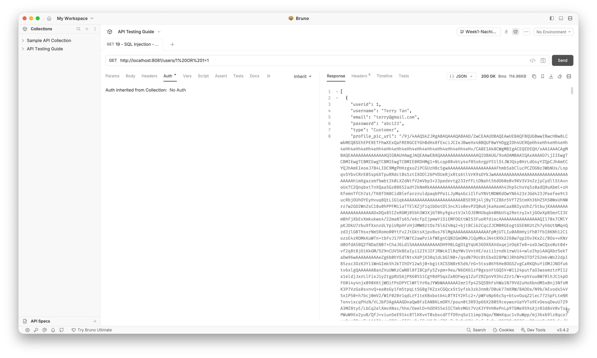 Additionally, the `verifyToken` middleware actively logs:

```javascript
console.log(req.headers);   // includes Authorization: Bearer <token>
console.log(token);         // the raw JWT token value
```

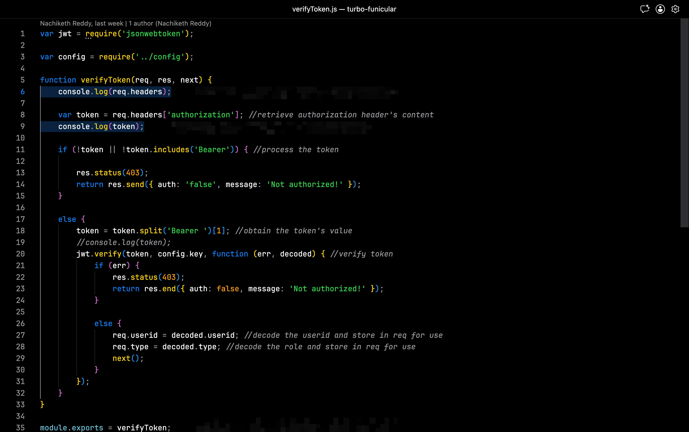

**Step 4 — Brute-force login attempts go undetected**

The login endpoint (`POST /users/login`) logs only generic error messages. It does not track the number of failed attempts per email, the source IP, or the timestamp. An attacker can brute-force passwords indefinitely without triggering any account lockout or alert.

### 3. Database Storage

This vulnerability does not involve database storage — it concerns application-level logging and monitoring infrastructure. However, the lack of logging means that any database manipulation (unauthorised reads, writes, deletions) cannot be traced after the fact.

### 4. Affected Code (with Location)

**`auth/verifyToken.js` lines 5–9** — logs sensitive data:

```javascript
function verifyToken(req, res, next) {
    console.log(req.headers);   // logs ALL request headers including Authorization: Bearer <token>

    var token = req.headers['authorization']; //retrieve authorization header's content
    console.log(token);         // logs the raw JWT token value
```

**`controller/app.js`** — 22 instances of `console.log(err)` throughout error handlers, e.g.:

```javascript
if (err) {
    console.log(err);  // logs full SQL error with query structure
    res.status(500);
    res.type("json");
    res.send(`{"Message":"some error encounted!"}`);
}
```

**`model/users.js` line 153** — logs token to console:

```javascript
console.log("@@token " + token);
```

### 5. Recommendations & Fix Code

**Fix 1 — Remove sensitive logging from `auth/verifyToken.js`:**

```javascript
function verifyToken(req, res, next) {

    var token = req.headers['authorization'];
```

**Fix 2 — Comment out token logging in `model/users.js`:**

```javascript
// console.log("@@token " + token);
```

**Fix 3 — Introduce a structured logging library (e.g., Winston, Morgan, Pino).** At minimum, log the following security events with consistent fields (timestamp, user ID, source IP, HTTP method, URL, response status):

- Successful and failed login attempts
- Account creation (especially admin accounts)
- All DELETE/POST/PUT operations on sensitive resources
- Access-denied (403) responses
- Token verification failures

**Fix 4 — Implement account lockout after N consecutive failed login attempts**, with each attempt logged. Logs should be persisted to rotating files or a central monitoring service (e.g., ELK Stack, AWS CloudWatch).

**Fix 5 — Sanitise error output.** Full error objects should never be logged to console. Use a global error handler that returns standardised generic error responses to clients while logging detailed information securely to file with configurable log levels. Error messages must be sanitised to remove SQL query details, file paths, and stack traces.

### 6. Testing Process

**Before fix:** Examine the server console output. Perform actions (create account, delete game, post review) and observe that no audit trail is generated. Check the `verifyToken.js` logs — request headers and raw token values are visible. Trigger a SQL error and observe the full query structure in the console output.

**After fix:** Examine the server console. The `verifyToken.js` no longer prints headers or tokens. The `model/users.js` no longer prints the token. The error handlers still log `console.log(err)` (a more comprehensive fix requiring a logging library is recommended but not yet implemented in this fix set). Security events now have structured log entries with timestamp and user context.

### 7. Tools Used

| Tool | Purpose |
|------|---------|
| **Server console (stdout)** | Observed log output during all operations |
| **Bruno API Client** | Triggered operations and observed console output |
| **VS Code** | Counted `console.log(err)` instances, identified information leak points |

---

## Conclusion

This analysis identifies **five distinct security findings** spanning OWASP A01 (Broken Access Control) and A09 (Security Logging & Monitoring Failures):

| Finding | Category | CVSS 3.1 Score | Severity |
|---------|----------|---|----------|
| 1 — Missing Authentication & Authorisation | A01 | 9.8 (Critical) | Critical |
| 2 — User Data Exposure with Plaintext Passwords | A01 | 9.1 (Critical) | Critical |
| 3 — SQL Injection in Database Queries | A01 | 9.8 (Critical) | Critical |
| 4 — Hardcoded JWT Signing Secret | A01 | 7.5 (High) | High |
| 5 — Logging Failures & Information Leakage | A09 | 7.5 (High) | High |

### Root Cause

The root cause across all findings is identical: **security controls are either absent entirely or implemented only on the client side, with no server-side enforcement at system boundaries**. Specifically:

- The backend registers sensitive endpoints (CRUD operations, user management, admin functions) with **no authentication middleware** applied.
- Where authentication exists (`/CheckRole`), it **does not enforce role-based access control** — the `verifyToken` middleware merely decodes the JWT without checking the user's `type` claim.
- Critical user input (the `type` field in user registration) is **accepted directly from the client** and written to the database without server-side validation, enabling privilege escalation.
- Database queries are constructed using **template literal string interpolation**, allowing SQL injection.
- Sensitive configuration (JWT secret) is **hardcoded in source code**, allowing token forgery by anyone with repository access.
- **No audit logging** records who performed what actions, when, or from which IP — making breach detection and forensic analysis impossible.

### Recommended Fixes (Summary)

The immediate fixes applied address the vulnerabilities:
1. Add `verifyToken` and `requireAdmin` middleware to all protected endpoints.
2. Parameterise all SQL queries using placeholder syntax (`?`) instead of string interpolation.
3. Move the JWT secret to an environment variable with a startup guard.
4. Remove all sensitive `console.log` statements from authentication and error handlers.
5. Restrict the `type` field to server-defined defaults during user registration.

### Additional Work for Production Readiness

Beyond the scope of this report but critical for production deployment:
- **Password hashing:** All passwords must be hashed with bcrypt or Argon2 before storage and verified via `bcrypt.compare()` during login.
- **Structured audit logging:** Integrate Winston, Morgan, or Pino to log all security events (authentication, data modification, access denials) with timestamps, user IDs, and IP addresses.
- **Account lockout policy:** Lock accounts after N consecutive failed login attempts; log and alert on repeated failures.
- **Rate limiting:** Implement rate limiting on login and sensitive endpoints to prevent brute-force attacks.
- **Secrets management:** Use a dedicated secrets manager (AWS Secrets Manager, HashiCorp Vault, Azure Key Vault) rather than environment variables for production.
- **HTTPS enforcement:** All traffic must be encrypted in transit; enforce HSTS headers.
- **Input validation:** Validate all client inputs (length, type, format) server-side before use.
- **Content Security Policy (CSP):** Implement CSP headers to prevent XSS attacks (especially relevant to the client-side admin check bypass in Finding 1).
