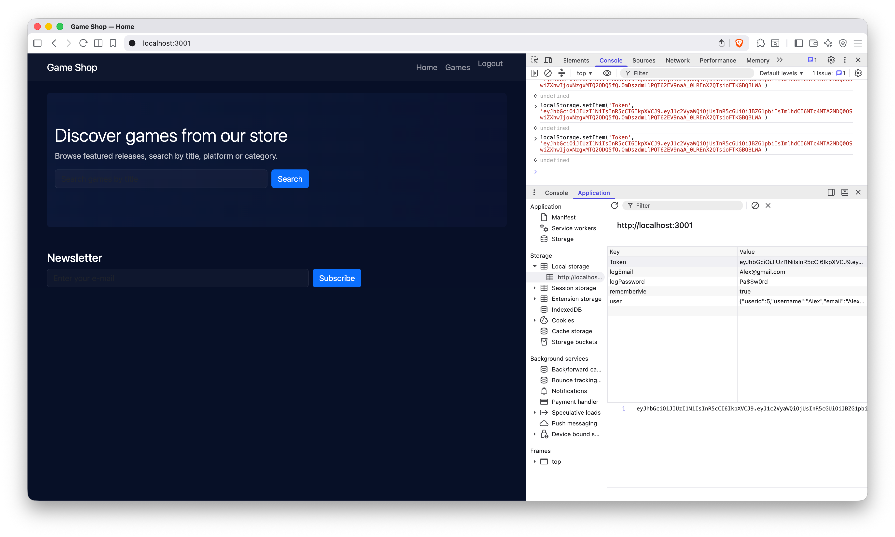
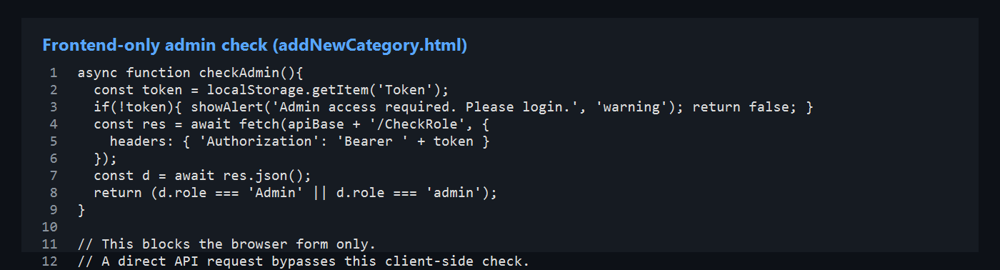
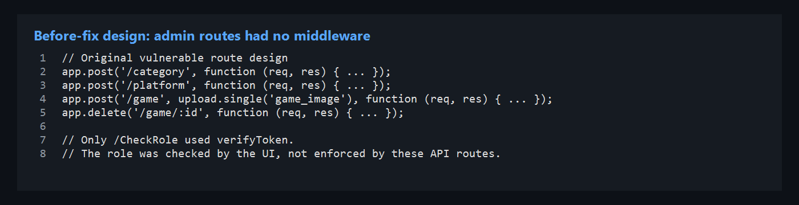
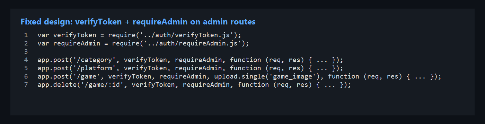
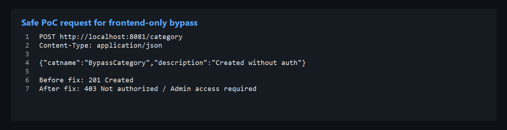
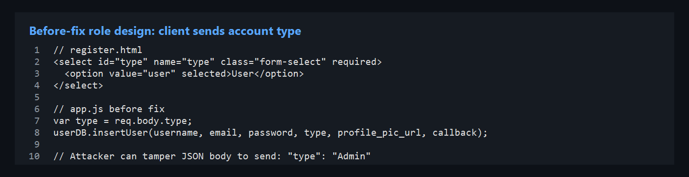
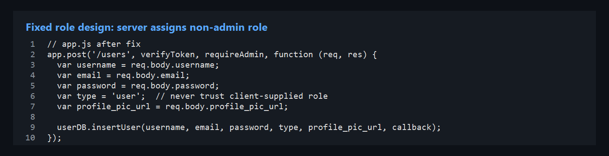

# ST2515 — Secure Vulnerability Analysis Report

## SP Games Web Application — Consolidated OWASP Assessment

---

## 1. Executive Summary

This consolidated report documents a full security assessment of the **SP Games** game catalogue application (`turbo-funicular`). The stack is Node.js/Express (port **8081**), a static HTML/CSS/JavaScript frontend, MySQL database `sp_games`, and JWT authentication.

The team identified **fourteen distinct vulnerabilities** across six OWASP Top 10 2021 categories. Before remediation, the combined risk was **critical**: an unauthenticated attacker could create admin accounts, read plaintext passwords, inject SQL, forge JWTs, bypass frontend-only controls, and operate without audit trails.

| OWASP | Author | Findings | Severity |
|-------|--------|----------|----------|
| **A01** Broken Access Control | Nachiketh | 4 | Critical |
| **A04** Insecure Design | Sitt | 2 | Critical / High |
| **A03** Injection | Mike | 3 | High / Medium |
| **A07** Auth Failures | Keefe | 3 | High / Medium |
| **A02** Cryptographic Failures | Keefe | 1 | High |
| **A09** Logging & Monitoring | Nachiketh | 1 (5 sub-issues) | High |

**Remediation status:** Server-side access control, SQL parameterisation, JWT secret externalisation, structured audit logging, and enumeration fixes are applied in the repository. Password bcrypt hashing, HTTPS enforcement, and httpOnly cookie migration remain recommended follow-up work.

---

## 2. Assessment Methodology

| Item | Detail |
|------|--------|
| Backend | `Assignment/BackEndServer` — Express API, port **8081** |
| Frontend | `Assignment/FrontEndServer/Public` — static HTML/JS |
| Database | MySQL `sp_games` |
| API testing | Bruno — `API-Testing/opencollection.yml` |
| Test accounts | John (Admin) `John@gmail.com` / `abc123`; Terry (Customer) `terry@gmail.com` / `abc123` |
| Evidence | `Assets/Nachiketh/`, `Assets/Mike/`, `Assets/Sitt/` |

Each finding below uses the course **seven-part structure**:

1. Vulnerability & type of flaw  
2. Exploitation (proof of concept)  
3. Database storage  
4. Affected code (with location)  
5. Recommendations & fix code  
6. Testing process  
7. Tools used  

---

# Part I — OWASP A01: Broken Access Control

**Author:** Nachiketh Reddy Y

### A01 overview

Four Broken Access Control findings documented below.

A security assessment of the game catalogue web application (Express.js API on port **8081**, MySQL database `sp_games`, JWT authentication) revealed **four critical-to-high vulnerabilities** under OWASP Top 10 2021 category **A01 — Broken Access Control**. Together, these flaws allowed unauthenticated or low-privilege attackers to administer the entire system, read sensitive credentials, manipulate the database through injection, and forge admin tokens.

| Item | Detail |
|------|--------|
| **Overall risk** | Critical (before remediation) |
| **Impact** | Full confidentiality, integrity, and availability of user accounts, games, categories, platforms, and reviews |
| **Affected components** | `controller/app.js`, `model/users.js`, `model/game.js`, `config.js`, `auth/verifyToken.js` |
| **Remediation status** | Code fixes applied; password hashing and post-fix screenshot evidence still pending |

**Key findings:**

1. **Missing authentication and authorisation** — sensitive CRUD endpoints ran with no server-side access control; admin UI relied on client-side CSS only.
2. **Plaintext password exposure** — `GET /users` returned every user's password in the JSON response; passwords are stored unhashed in MySQL.
3. **SQL injection** — user input was interpolated directly into SQL strings instead of bound parameters.
4. **Hardcoded JWT secret** — the signing key `Assignment2key` was embedded in source code, enabling token forgery.

---

## Finding 1 — Missing Authentication & Authorisation on API Endpoints

### 1. Vulnerability & Type of Flaw


The application suffers from **Broken Access Control (A01)**. Sensitive API routes — user management, game CRUD, category/platform administration — were registered **without** `verifyToken` or role-checking middleware. Only `/CheckRole` used JWT verification, and no endpoint enforced admin vs customer roles.

The admin dashboard (`admin.html`) applied a CSS `locked` class when the user was not an admin. That is a presentation-layer hint, not a security boundary. Removing the class in browser DevTools restored full interactivity without the server granting access.

Registration also accepted a client-supplied `type` field, so any caller could escalate to `admin` at account creation time.

| Attribute | Value |
|-----------|-------|
| **CVSS 3.1** | 9.8 (Critical) |
| **Vector** | `CVSS:3.1/AV:N/AC:L/PR:N/UI:N/S:U/C:H/I:H/A:H` |

### Mechanism of Action

1. **Unprotected routes:** `GET /users`, `POST /users`, `DELETE /game/:id`, and similar endpoints processed requests with no `Authorization` header check.
2. **Client-trusted roles:** `POST /users` stored whatever `type` value the client sent — including `"admin"`.
3. **Client-side admin gate:** The frontend hid admin controls with CSS; the API never verified the caller's role.

---

### 2. Exploitation

### Step 1 — Enumerate unprotected endpoints

Using Bruno (`API-Testing/opencollection.yml`), most requests succeeded without an `Authorization` header. The collection exposed the full attack surface: user CRUD, game delete, category/platform create.

```http
GET /users HTTP/1.1
Host: localhost:8081
```

**Expected before fix:** `200 OK` with full user list — no token required.


### Step 2 — Create an admin account without authentication

An attacker registers with an elevated role by supplying `type` in the JSON body:

```http
POST /users HTTP/1.1
Host: localhost:8081
Content-Type: application/json

{
  "username": "hacker",
  "email": "hacker@test.com",
  "password": "hack",
  "type": "admin"
}
```

**Response before fix:** `201 Created` — a new admin account exists with zero authentication.


### Step 3 — Delete a game without authentication

```http
DELETE /game/14 HTTP/1.1
Host: localhost:8081
```

**Response before fix:** `204 No Content` — game row removed from the `game` table.


### Step 4 — Bypass client-side admin lock

1. Open `admin.html` in the browser.
2. Open DevTools → Elements.
3. Remove the `locked` class from the admin container.

The admin UI becomes fully interactive. Any subsequent API call still succeeds because the backend does not enforce role checks.


---

### 3. Database Storage

Without server-side access control, every table was reachable through the API:

| Table | Risk |
|-------|------|
| `users` | Create admin accounts, read all rows |
| `game` | Insert, update, or delete catalogue entries |
| `category`, `platform` | Modify taxonomy data |
| `review` | Post reviews attributed to arbitrary user IDs |

---

### 4. Affected Code (with Location)

**Before:** routes had no middleware.

```javascript
// Vulnerable pattern (original assignment code)
app.get('/users', function (req, res) { /* ... */ });
app.post('/users', function (req, res) {
    var type = req.body.type;  // attacker-controlled role
    /* ... */
});
app.delete('/game/:id', function (req, res) { /* ... */ });
```

**After fix** — `controller/app.js`:

```javascript
var verifyToken = require('../auth/verifyToken.js');
var requireAdmin = require('../auth/requireAdmin.js');

app.get('/users', verifyToken, requireAdmin, function (req, res) { /* ... */ });

app.post('/users', verifyToken, requireAdmin, function (req, res) {
    var type = 'user';  // never trust client-supplied role
    /* ... */
});

app.delete('/game/:id', verifyToken, requireAdmin, function (req, res) { /* ... */ });
```

**New middleware** — `auth/requireAdmin.js`:

```javascript
function requireAdmin(req, res, next) {
    if (String(req.type || '').toLowerCase() !== 'admin') {
        res.status(403);
        return res.json({ auth: false, message: 'Admin access required!' });
    }
    next();
}
```

`verifyToken` decodes the JWT and attaches `req.userid` and `req.type` for downstream checks.

**Vulnerable route registrations** — `controller/app.js` (before fix):





---

### 5. Recommendations & Fix Code

### 6. Testing Process

| Test | Before fix | After fix |
|------|------------|-----------|
| `GET /users` — no token | `200` + data | **403** `Not authorized!` |
| `DELETE /game/14` — no token | `204` | **403** |
| `POST /users` with `"type":"admin"` — no token | `201` admin created | **403** |
| `GET /users` — Terry (customer) token | `200` | **403** `Admin access required!` |
| `GET /users` — John (admin) token | `200` | **200** (authorised) |

Post-fix screenshots: save to `Assets/Nachiketh/a01-after/` per [postfix-screenshots guide](../guides/postfix-screenshots.md).

---

## Finding 2 — User Data Exposure with Plaintext Passwords

### 1. Vulnerability & Type of Flaw


**Broken Access Control combined with Sensitive Data Exposure.** The `GET /users` endpoint returned every column from the `users` table, including the `password` field. Passwords are stored and compared as plain strings — no bcrypt or hashing on insert or login.

| Attribute | Value |
|-----------|-------|
| **CVSS 3.1** | 9.1 (Critical) |

### Mechanism of Action

1. **Over-fetching:** The SQL `SELECT` included `password` and the API serialised it into JSON.
2. **No access gate:** Before the A01 fix, any caller could invoke `GET /users`.
3. **Plaintext storage:** Login compared `req.body.password` directly against the database value.

---

### 2. Exploitation

### Step 1 — Fetch all users with passwords

```http
GET /users HTTP/1.1
Host: localhost:8081
```

**Response before fix (excerpt):**

```json
[
  {
    "userid": 1,
    "username": "Alex",
    "email": "Alex@gmail.com",
    "password": "abc123",
    "type": "user"
  }
]
```


### Step 2 — Reuse exposed credentials

```http
POST /users/login HTTP/1.1
Host: localhost:8081
Content-Type: application/json

{"email":"Alex@gmail.com","password":"abc123"}
```

**Response:** `200 OK` with a valid JWT — account takeover without brute force.


---

### 3. Database Storage

```sql
-- users.password stored as VARCHAR(255), plaintext
INSERT INTO users (username, email, password, type, ...)
VALUES ('Alex', 'Alex@gmail.com', 'abc123', 'user', ...);
```

| Column | Exposure risk |
|--------|---------------|
| `password` | Returned in API JSON; reusable for login |
| `email`, `type` | Supports targeted phishing and privilege mapping |

---

### 4. Affected Code (with Location)

**Before** — `model/users.js`:

```javascript
var getUserSql = `select userid, username, email, password, type, profile_pic_url,
                    DATE_FORMAT(created_at, '%Y-%m-%d %H:%i:%s') AS created_at FROM users`;
```

**After fix** — password removed from all `SELECT` queries; endpoint gated by admin JWT:

```javascript
var getUserSql = `select userid, username, email, type, profile_pic_url,
                    DATE_FORMAT(created_at, '%Y-%m-%d %H:%i:%s') AS created_at FROM users`;
```

```javascript
app.get('/users', verifyToken, requireAdmin, function (req, res) { /* ... */ });
```


**Remaining work:** hash passwords with bcrypt on `insertUser` and use `bcrypt.compare` on login.

---

### 5. Recommendations & Fix Code

### 6. Testing Process

| Test | Before fix | After fix |
|------|------------|-----------|
| `GET /users` response shape | Includes `password` key | No `password` field |
| Unauthenticated `GET /users` | `200` | **403** |
| Authenticated admin `GET /users` | Passwords visible | User metadata only |

---

## Finding 3 — SQL Injection in Database Queries

### 1. Vulnerability & Type of Flaw


**Injection (classified under A01 in this assessment).** Original queries built SQL with template-literal interpolation (`${userid}`, `'${title}'`) instead of bound `?` placeholders. The database engine could not distinguish attacker-supplied syntax from intended query structure.

| Attribute | Value |
|-----------|-------|
| **CVSS 3.1** | 9.8 (Critical) |

### Mechanism of Action

1. **String concatenation:** User input became part of the SQL text.
2. **Logic alteration:** Payloads like `1 OR 1=1` broadened `WHERE` clauses.
3. **Error leakage:** Malformed queries triggered `console.log(err)` dumping full `ER_*` messages (also an A09 issue — see [nachiketh-report-a09.md](nachiketh-report-a09.md)).

---

### 2. Exploitation

### Step 1 — Injection via user ID parameter

```http
GET /users/1%20OR%201=1 HTTP/1.1
Host: localhost:8081
```

**Before fix:** the query became:

```sql
SELECT ... FROM users WHERE userid = 1 OR 1=1;
```

All user rows were returned — including plaintext passwords when the vulnerable `SELECT` still included that column.


### Step 2 — Injection via game creation fields

A crafted `title` in `POST /game` could break out of the SQL string and append arbitrary clauses.

---

### 3. Database Storage

MySQL executed attacker-controlled strings as part of query structure. No separation existed between SQL code and user data at the application layer.

---

### 4. Affected Code (with Location)

**Before** — `model/users.js`:

```javascript
var getUserByUserIDSql = `... FROM users where userid = ${userid};`;
dbConn.query(getUserByUserIDSql, function (err, results) { /* ... */ });
```

**After fix:**

```javascript
var getUserByUserIDSql = `... FROM users where userid = ?;`;
dbConn.query(getUserByUserIDSql, [userid], function (err, results) { /* ... */ });
```

**Before** — `model/game.js`:

```javascript
var insertGameSql = `INSERT INTO game (title, ...) VALUES ('${title}', ...);`;
```

**After fix:**

```javascript
var insertGameSql = `INSERT INTO game (title, game_description, year, game_image) VALUES (?, ?, ?, ?);`;
dbConn.query(insertGameSql, [title, game_description, year, game_image.buffer], ...);
```

The same `?` placeholder pattern was applied across all model files.


---

### 5. Recommendations & Fix Code

### 6. Testing Process

| Test | Before fix | After fix |
|------|------------|-----------|
| `GET /users/1 OR 1=1` | All users returned | Empty or single literal match |
| `POST /game` with SQL in `title` | Query manipulation possible | Payload stored as literal string or rejected |
| SQL error in API response | Full query details possible | Generic `Internal Server Error` JSON |

---

## Finding 4 — Hardcoded JWT Signing Secret

### 1. Vulnerability & Type of Flaw


**Cryptographic Failure (A01-related).** The JWT signing key was hardcoded in `config.js` as `Assignment2key`. Anyone with source access — or who guessed the assignment default — could mint valid admin tokens.

| Attribute | Value |
|-----------|-------|
| **CVSS 3.1** | 7.5 (High) |

### Mechanism of Action

1. **Static secret:** `jwt.sign` and `jwt.verify` both used the same embedded string.
2. **Forgery:** An attacker signs arbitrary claims (`userid`, `type: 'admin'`) offline.
3. **Bypass:** Forged tokens pass `verifyToken` and satisfy `requireAdmin`.

---

### 2. Exploitation

```javascript
const jwt = require('jsonwebtoken');
const forged = jwt.sign(
    { userid: 999, type: 'admin' },
    'Assignment2key',
    { expiresIn: 86400 }
);
```

```http
GET /users HTTP/1.1
Host: localhost:8081
Authorization: Bearer <forged>
```

**Before fix:** `200 OK` — full user list returned under a forged admin identity.


---

### 4. Affected Code (with Location)

**Before** — `config.js`:

```javascript
var secret = 'Assignment2key';
module.exports.key = secret;
```


**After fix:**

```javascript
var secret = process.env.JWT_SECRET;
if (!secret) {
    console.error('FATAL: JWT_SECRET environment variable is not set.');
    process.exit(1);
}
module.exports.key = secret;
```

Set `JWT_SECRET` in `.env` locally and in a secrets manager for production. The server refuses to start if the variable is missing.

---

### 5. Recommendations & Fix Code

### 6. Testing Process

| Test | Before fix | After fix |
|------|------------|-----------|
| Token signed with `Assignment2key` | Accepted | **403** when env secret differs |
| Server start without `JWT_SECRET` | Starts normally | **Exits with FATAL error** |

---

# Part II — OWASP A04: Insecure Design

**Author:** Sitt Naing

Two design flaws share the same root cause: the application trusted the client to enforce security.

---

## Finding 5 — Frontend-Only Admin Access Control

### 1. Vulnerability & Type of Flaw

**Type:** OWASP A04 — Insecure Design (client-side-only authorization)

**CVSS 3.1:** 9.8 (Critical)

Admin pages call `/CheckRole` in browser JavaScript. Privileged backend routes originally had no `verifyToken` or `requireAdmin` middleware.







### 2. Exploitation

```http
POST /category HTTP/1.1
Host: localhost:8081
Content-Type: application/json

{"catname":"BypassCategory","description":"Created without auth"}
```

**Before fix:** `201 Created` for category, platform, game create, and game delete — no token required.



### 3. Database Storage

Tables `category`, `platform`, `game`, `game_platform`, `game_category` — unauthorised writes and deletes.

### 4. Affected Code (with Location)

**File:** `addNewCategory.html` — `checkAdmin()` (UX only)

**File:** `controller/app.js` — before: `app.post('/category', function...)`; after: `verifyToken, requireAdmin`

### 5. Recommendations & Fix Code

Server-side middleware on every privileged route. Frontend checks are usability only.

### 6. Testing Process

| Test | Before | After |
|------|--------|-------|
| POST /category no token | 201 | 403 |
| DELETE /game/:id no token | 204 | 403 |

### 7. Tools Used

curl, Bruno, Browser DevTools, VS Code

---

## Finding 6 — Client-Controlled Role Assignment During Registration

### 1. Vulnerability & Type of Flaw

**Type:** OWASP A04 — Insecure Design

**CVSS 3.1:** 8.1 (High)

Backend accepted `req.body.type` from registration — attackers self-assigned Admin.





### 2. Exploitation

```json
{"username":"attacker_admin","email":"a@x.com","password":"p","type":"Admin"}
```

### 3. Database Storage

`users.type` column — must be server-assigned.

### 4. Affected Code (with Location)

`register.html` sends `type`; `app.post('/users')` stored `req.body.type`. Fixed: `var type = 'user'`.

### 5. Recommendations & Fix Code

Remove type from public forms; admin-only user creation route.

### 6. Testing Process

Register with type Admin → before: admin account; after: 403 or role ignored.

### 7. Tools Used

HTTP tampering, MySQL schema review, VS Code

# Part III — OWASP A03: Injection

**Author:** Mike Franco Abat

## Finding 7 - SQL Injection in `GET /users/:userid`

### 1. Vulnerability & Type of Flaw

**Type:** OWASP A03 - Injection / SQL Injection

The `GET /users/:userid` route reads `userid` from the URL and passes it into `userDB.getUserByUserid()` without validation or parameterization. In the model layer, that value is concatenated directly into the `WHERE` clause of the SQL statement.

This is a classic SQL Injection sink because the database engine cannot distinguish between the intended numeric identifier and attacker-supplied SQL syntax. The query also selects the `password` column, which means a successful injection can expose sensitive account data in the response.

### 2. Exploitation

The easiest proof-of-concept is to replace the expected numeric ID with a payload that changes the query logic:

```http
GET /users/1 OR 1 = 1
```

If the backend accepts the payload as part of the SQL expression, the `WHERE` clause becomes broader than intended. Instead of returning only one user row, the query can return multiple user records.

That is dangerous for two reasons:

- the attacker can enumerate user data they were never meant to see
- the response can include `password`, `email`, and other profile fields

Relevant screenshots:


### 3. Database Storage

The affected data is stored in the `users` table.

Relevant columns:

- `userid`
- `username`
- `email`
- `password`
- `type`
- `profile_pic_url`
- `created_at`

The report is especially concerned with `password`, because the vulnerable query selects it directly. Even if the database itself is not compromised, exposing the field through the API creates a major confidentiality issue.

### 4. Affected Code (with Location)

**File:** `Assignment/BackEndServer/controller/app.js`

```javascript
app.get('/users/:userid', function (req, res) {
    var userid = req.params.userid;
    userDB.getUserByUserid(userid, function (err, results) {
        ...
    });
});
```

**File:** `Assignment/BackEndServer/model/users.js`

```javascript
var getUserByUserIDSql = `select userid, username, email, password, type, profile_pic_url,
                            DATE_FORMAT(created_at, '%Y-%m-%d %H:%i:%s') AS created_at FROM users where userid = ${userid};`;
```

Line range to cite in the report:

- controller route: `Assignment/BackEndServer/controller/app.js:308-314`
- model sink: `Assignment/BackEndServer/model/users.js:87-103`

### 5. Recommendations & Fix Code

The fix is to use a parameterized query and remove the password field from the response unless the endpoint explicitly needs it.

Recommended pattern:

```javascript
var getUserByUserIDSql = `
    SELECT userid, username, email, type, profile_pic_url,
           DATE_FORMAT(created_at, '%Y-%m-%d %H:%i:%s') AS created_at
    FROM users
    WHERE userid = ?;
`;

dbConn.query(getUserByUserIDSql, [userid], function (err, results) {
    ...
});
```

This matters because `?` tells MySQL to treat the incoming value as data, not as part of the SQL grammar.

### 6. Testing Process

Before the fix:

- Send `GET /users/1 OR 1 = 1`
- Observe whether the API returns more rows than a single user
- Check whether the response includes sensitive fields like `password`

After the fix:

- The same input should no longer change the query structure
- The backend should either return no match, validate the ID, or reject the request as invalid

### 7. Tools Used

| Tool | Purpose |
|------|---------|
| Manual code review | Identified the unsafe query construction |
| Bruno / API request tool | Captured the proof-of-concept request and response |
| VS Code | Located the route and model sink |

---

## Finding 8 - SQL Injection in `POST /game`

### 1. Vulnerability & Type of Flaw

**Type:** OWASP A03 - Injection / SQL Injection

The `POST /game` route receives form data for the game title, description, year, price, platform, category, and image. The controller forwards the title, description, and year into `insertGame()`, and the model builds the SQL statement with string interpolation.

The vulnerable part is the use of `${title}`, `${game_description}`, and `${year}` inside the `INSERT` query. Once a quote character or SQL fragment enters one of those fields, the query can break or be altered.

### 2. Exploitation

An attacker can submit a crafted game creation request using a quote in `title` or `description`. Even if the request is not meant to execute a second statement, it can still break the `INSERT` syntax and trigger a server error.

Example idea:

- set `title` to `Test Game2'`
- keep the rest of the fields valid
- send the normal `POST /game` request

If the SQL is unsafe, the backend may respond with a `500 Internal Server Error` because the query string is no longer valid SQL.

Relevant screenshots:


### 3. Database Storage

The main row is stored in the `game` table.

The write flow also inserts into:

- `game_platform`
- `game_category`

This means one unsafe game create request can affect multiple tables. Even though the first query is the injection sink, the rest of the write flow depends on the first insert succeeding, so a broken query can leave the application in an incomplete or inconsistent state.

### 4. Affected Code (with Location)

**File:** `Assignment/BackEndServer/controller/app.js`

```javascript
app.post('/game', upload.single('game_image'), function (req, res) {
    var title = req.body.title;
    var game_description = req.body.description;
    var year = req.body.year;
    var game_image = req.file;

    gameDB.insertGame(title, game_description, year, game_image, function (err, results) {
        ...
    });
});
```

**File:** `Assignment/BackEndServer/model/game.js`

```javascript
var insertGameSql = `INSERT INTO game (title, game_description, year, game_image) VALUES ('${title}', '${game_description}', '${year}', ?);`;
```

Line range to cite in the report:

- controller route: `Assignment/BackEndServer/controller/app.js:435-471`
- model sink: `Assignment/BackEndServer/model/game.js:153-160`

### 5. Recommendations & Fix Code

The fix is to parameterize the entire insert and keep the image as a bound value rather than building it into the SQL string.

Recommended pattern:

```javascript
var insertGameSql = `
    INSERT INTO game (title, game_description, year, game_image)
    VALUES (?, ?, ?, ?)
`;

dbConn.query(insertGameSql, [title, game_description, year, game_image.buffer], function (err, results) {
    ...
});
```

Additional hardening:

- validate `year` as a number
- reject empty or unusually long titles and descriptions
- ensure `game_image` exists before reading `.buffer`

### 6. Testing Process

Before the fix:

- send a `POST /game` request with a quoted title such as `Test Game2'`
- observe whether the backend returns `500`
- check whether the console or response reveals an SQL error

After the fix:

- the same request should no longer change the SQL structure
- the backend should either insert safely or reject invalid input before the query runs

### 7. Tools Used

| Tool | Purpose |
|------|---------|
| Manual code review | Located the interpolated `INSERT` query |
| Bruno / API request tool | Triggered the failing game creation request |
| VS Code | Cross-checked the controller and model paths |

---

## Finding 9 - SQL Injection in `updateGame()`

### 1. Vulnerability & Type of Flaw

**Type:** OWASP A03 - Injection / SQL Injection

The `updateGame()` helper in `model/game.js` uses the same unsafe pattern as `insertGame()`. It places `title`, `game_description`, `year`, `game_image.buffer`, and `gameID` directly into the SQL text.

I did not find a direct public route calling this helper in `controller/app.js`, so this is best described as a code-level vulnerability rather than a confirmed live-route exploit. Even so, it should still be reported because it is ready to become exploitable if a route is added later or if an existing route is refactored to use it.

### 2. Exploitation

There is no direct HTTP path to this helper in the current controller, so the exploit here is a code-path risk rather than a live request.

If a future route passes raw request data into this helper, an attacker could inject SQL through:

- `title`
- `game_description`
- `year`
- `gameID`

Because the `WHERE` clause also interpolates `gameID`, the update could affect the wrong row or become broader than intended.

### 3. Database Storage

The affected data is stored in the `game` table.

Relevant columns:

- `title`
- `game_description`
- `year`
- `game_image`
- `gameID`

This helper directly modifies existing game records, so a successful injection could damage content integrity as well as availability.

### 4. Affected Code (with Location)

**File:** `Assignment/BackEndServer/model/game.js`

```javascript
var updateGameSql = `update game set title='${title}', game_description='${game_description}', year='${year}', game_image='${game_image.buffer}' where gameID='${gameID}`;
```

Line range to cite in the report:

- model sink: `Assignment/BackEndServer/model/game.js:293-306`

### 5. Recommendations & Fix Code

The fix is to parameterize every field, including the record identifier in the `WHERE` clause.

Recommended pattern:

```javascript
var updateGameSql = `
    UPDATE game
    SET title = ?, game_description = ?, year = ?, game_image = ?
    WHERE gameID = ?
`;

dbConn.query(updateGameSql, [title, game_description, year, game_image.buffer, gameID], function (err, results) {
    ...
});
```

This closes the injection sink and also makes the update logic easier to read and maintain.

### 6. Testing Process

Before the fix:

- inspect the helper code and confirm it uses string interpolation
- verify that `gameID` is inserted directly into the SQL string

After the fix:

- confirm the query uses `?` placeholders only
- ensure the helper still updates the intended row when called with valid data

### 7. Tools Used

| Tool | Purpose |
|------|---------|
| Manual code review | Found the unsafe update helper |
| Source search | Checked whether any controller route calls it directly |

---

# Part IV — OWASP A07 & A02: Authentication and Cryptographic Failures

**Author:** Keefe Chen Lin Li

---

## Finding 10 — Plaintext Password Storage and Lack of Hashing

### 1. Vulnerability & Type of Flaw

**Type:** OWASP A07 — Identification and Authentication Failures | **CVSS 3.1:** 9.1 (Critical)

Passwords stored and compared as plain strings.

### 2. Exploitation

Database or API exposure reveals `password: password123` directly.


### 3. Database Storage

`users.password` — plaintext before fix; bcrypt hash after.

### 4. Affected Code (with Location)

`model/users.js` — `insertUser`, `loginUser`

### 5. Recommendations & Fix Code

`bcrypt.hash` on insert; `bcrypt.compare` on login.


### 6. Testing Process

DB shows hash prefix `$2a$10$` after fix.

### 7. Tools Used

MySQL Workbench, Postman, DevTools

---

## Finding 11 — Hardcoded JWT Secret Key

### 1. Vulnerability & Type of Flaw

**Type:** OWASP A07 | **CVSS 3.1:** 7.5 (High)

`Assignment2key` in source — forge admin JWTs. *(See also A01 Finding 4.)*

### 2. Exploitation

`jwt.sign({userid:999,type:'admin'},'Assignment2key')`


### 3. Database Storage

N/A — application config.

### 4. Affected Code (with Location)

`config.js`

### 5. Recommendations & Fix Code

`process.env.JWT_SECRET`; exit if unset.

### 6. Testing Process

Forged token rejected after secret change.

### 7. Tools Used

VS Code, Postman, Node.js jsonwebtoken

---

## Finding 12 — Session Hijacking via Client-Side Token Storage

### 1. Vulnerability & Type of Flaw

**Type:** OWASP A07 | **CVSS 3.1:** 6.5 (Medium)

JWT in `localStorage` — stealable via XSS.

### 2. Exploitation

`localStorage.getItem("Token")` → replay on `/CheckRole`.


### 3. Database Storage

N/A — browser.

### 4. Affected Code (with Location)

Frontend `localStorage.setItem("Token", token)`

### 5. Recommendations & Fix Code

httpOnly secure sameSite cookies.

### 6. Testing Process

Token not readable via JS after cookie migration.

### 7. Tools Used

Chrome DevTools, Postman

---

## Finding 13 — Missing HTTPS Protection

### 1. Vulnerability & Type of Flaw

**Type:** OWASP A02 — Cryptographic Failures | **CVSS 3.1:** 7.4 (High)

HTTP cleartext for login and API calls.

### 2. Exploitation

MITM on `POST http://localhost:8081/users/login`.


### 3. Database Storage

N/A — network.

### 4. Affected Code (with Location)

Frontend `fetch("http://localhost:8081/...")`

### 5. Recommendations & Fix Code

TLS, HTTPS URLs, HSTS.

### 6. Testing Process

Traffic encrypted after TLS.

### 7. Tools Used

DevTools Network, Postman

# Part V — OWASP A09: Security Logging & Monitoring Failures

**Author:** Nachiketh Reddy Y

## Finding 14 — Security Logging & Monitoring Failures

### 1. Vulnerability & Type of Flaw

**Type:** OWASP A09 | **CVSS 3.1:** 7.5 (High)

No audit logging; `console.log(err)` SQL leakage; username/email enumeration; unlogged review impersonation. Token logging removed under A01.

### 2. Exploitation

### Step 1 — No audit trail on registration

An admin registers a user via `POST /users`. The backend terminal showed only the startup banner — no timestamp, actor, or action recorded.


**What this proves:** A successful account-creation event is invisible in logs. An attacker creating backdoor accounts would leave no structured evidence for incident response.

---

### Step 2 — SQL error details leaked to console

A malformed `POST /game` request triggered a database error. The full `ER_*` message with column names appeared in stdout via `console.log(err)`.


**What this proves:** Error handlers acted as an information-disclosure channel. Attackers probing input validation learn table and column names from log output.

---

### Step 3 — Username enumeration

Registering with an existing username returned a specific message revealing the account exists.


---

### Step 4 — Email enumeration

Registering with an existing email returned a **different** message — confirming the email is registered even when the username was new.


**Enumeration contrast:** The two distinct responses form a decision tree. An attacker cycles through candidate emails or usernames and maps which accounts exist in `users`.

---

### Step 5 — New-user contrast

Registering a brand-new username and email returned yet another response shape — proving attackers can distinguish "exists" from "new".


---

### Step 6 — Review impersonation without audit trail

An authenticated customer (Terry) posted a review attributed to another user's ID in the URL path. The server accepted the request and wrote the review — with no audit entry recording the mismatch.


**Attack flow:**

```http
POST /users/3/game/12/review HTTP/1.1
Host: localhost:8081
Authorization: Bearer <Terry's token>
Content-Type: application/json

{"content":"Fake review from Terry posing as user 3","rating":1}
```

Terry's JWT contains `userid: 2` (or similar), but the path says `3`. Before the fix, the server stored `fk_users = 3` with no ownership check and no audit line.

---

### Step 7 — Auth required after A01 fixes

After A01 remediation, A09 re-testing required a valid admin Bearer token on protected routes. The Bruno collection documents the login → copy token → set Collection Auth workflow.


---

### 3. Database Storage

Logging gaps are application-layer — not stored in MySQL. However, the flaws interact with the database:

| Behaviour | Database impact |
|-----------|-----------------|
| Enumeration responses | Indirectly confirms rows exist in `users` |
| SQL errors in stdout | Reveals `users`, `game`, and related schema details |
| Review impersonation | `review` rows inserted with arbitrary `fk_users` from the URL |

Example of an impersonated review row (conceptual):

| reviewID | fk_users | fk_games | content | rating |
|----------|----------|----------|---------|--------|
| `25` | **`3`** (victim) | `12` | Fake review posted by Terry | `1` |

---

### 4. Affected Code (with Location)

### Raw error logging — `controller/app.js`

`console.log(err)` appeared in error handlers throughout the file (~22 instances), logging full database error objects to stdout.


---

### Enumeration error messages — `controller/app.js`

Different client-facing messages revealed whether username, email, category, or platform already existed.


**Before fix (representative):**

```javascript
if (err.code === "ER_DUP_ENTRY") {
    console.log(err);
    res.status(422);
    res.send('{"Message":"Username already exists!"}');  // or email-specific text
}
```

---

### Model-layer logging — `model/users.js`

Error paths and a commented token log line in the login flow.


---

### Token logging — `auth/verifyToken.js` (remediated under A01)

Original code actively logged headers and tokens. A commented `//console.log(token)` remained from the assignment template.


Active header/token logging was removed during A01 hardening. The commented line is a reminder that debug logging near auth code is high risk.

---

### 5. Recommendations & Fix Code

A multi-layered approach addresses detection, disclosure, and authorisation gaps.

### Fix 1 — Structured audit logging and safe errors (`securityLog.js`)

```javascript
function audit(action, detail) {
    console.log(JSON.stringify({
        ts: new Date().toISOString(),
        level: 'audit',
        action: action,
        detail: detail || {}
    }));
}

function safeError(err) {
    var message = (err && err.message) ? err.message : String(err);
    console.error(JSON.stringify({
        ts: new Date().toISOString(),
        level: 'error',
        message: message
    }));
}
```

Every `console.log(err)` in controllers and models was replaced with `safeError(err)`. Security events call `audit()`:

| Event | Audit action |
|-------|--------------|
| User registered | `user_registered` |
| Login success / failure | `login_success` / `login_failed` |
| Game deleted | `game_deleted` |
| Review created | `review_created` |
| Review denied (impersonation) | `review_denied` |

### Fix 2 — Generic duplicate message (prevents enumeration)

```javascript
var DUPLICATE_MSG = '{"Message":"The requested resource already exists."}';

if (err.code === "ER_DUP_ENTRY") {
    safeError(err);
    res.status(422);
    res.send(DUPLICATE_MSG);
}
```

Username, email, category, and platform duplicates now return the same `422` body.

### Fix 3 — Review ownership check

```javascript
app.post('/users/:uid/game/:gid/review', verifyToken, function (req, res) {
    var userid = req.params.uid;

    if (String(req.userid) !== String(userid)) {
        audit('review_denied', { actor: req.userid, target: userid, gameID: gameID });
        res.status(403);
        return res.json({ auth: false, message: 'Not authorized!' });
    }
    /* ... insert review ... */
});
```

The JWT `userid` claim must match the `:uid` path parameter.

### Fix 4 — Production logging hygiene

- Ship logs to persistent storage (rotating files, ELK, CloudWatch) — stdout alone is lost on restart.
- Never log tokens, passwords, or full request headers.
- Alert on patterns: repeated `login_failed`, bursts of `review_denied`, spikes in `422` duplicates.

---

### 6. Testing Process

### Testing Methodologies

- **Code review:** Traced every `console.log` in `app.js`, model files, and `verifyToken.js`.
- **Manual API testing:** Bruno requests 15, 20–25 with and without Bearer tokens; terminal capture for log output.
- **Git history:** Confirmed `verifyToken` sensitive logging removal in the A01 commit.

### Remediation Results

| Test | Before fix | After fix |
|------|------------|-----------|
| Register user | Silent terminal | JSON audit: `"action":"user_registered"` |
| Login | No structured log | `"action":"login_success"` / `"login_failed"` |
| Duplicate register (username) | `"Username already exists!"` | Generic `422` — same message for email too |
| Duplicate register (email) | `"Email already exists!"` | Same generic `422` |
| SQL error | Full SQL stack in console | JSON `{"level":"error","message":"..."}` only |
| Terry → review as user 3 | `201 Created` | **403** + `review_denied` audit |
| `verifyToken` stdout | Headers/tokens logged (pre-A01) | No sensitive output |

Post-fix screenshots: save to `Assets/Nachiketh/a09-after/` per [postfix-screenshots guide](../guides/postfix-screenshots.md).
### 7. Tools Used

| Tool | Purpose |
|------|---------|
| Bruno API Client | Trigger registration, enumeration, impersonation |
| Backend terminal (stdout) | Observe logging before/after |
| VS Code | Locate logging and enumeration code |
| Git history | Confirm verifyToken fix in A01 commit |


---

# Conclusion

## Master Findings Summary

| # | Finding | OWASP | Author | Severity | Status |
|---|---------|-------|--------|----------|--------|
| 1 | Missing Authentication & Authorisation | A01 | Nachiketh | Critical | Fixed |
| 2 | Plaintext Password Exposure via API | A01 | Nachiketh | Critical | Partially fixed |
| 3 | SQL Injection (access control context) | A01 | Nachiketh | Critical | Fixed |
| 4 | Hardcoded JWT Secret | A01 | Nachiketh | High | Fixed |
| 5 | Frontend-Only Admin Access Control | A04 | Sitt | Critical | Fixed |
| 6 | Client-Controlled Role Assignment | A04 | Sitt | High | Fixed |
| 7 | SQL Injection in GET /users/:userid | A03 | Mike | High | Fixed |
| 8 | SQL Injection in POST /game | A03 | Mike | High | Fixed |
| 9 | SQL Injection in updateGame() | A03 | Mike | Medium | Fixed |
| 10 | Plaintext Password Storage | A07 | Keefe | Critical | Recommended |
| 11 | Hardcoded JWT Secret | A07 | Keefe | High | Fixed |
| 12 | Client-Side Token Storage | A07 | Keefe | Medium | Recommended |
| 13 | Missing HTTPS | A02 | Keefe | High | Recommended |
| 14 | Logging & Monitoring Failures | A09 | Nachiketh | High | Fixed |

## Root Causes

Security controls were absent, client-side, or debug-grade. SQL used interpolation. Secrets and credentials were mishandled. Logging was not monitored.

## Remaining Work

bcrypt hashing, httpOnly cookies, HTTPS/TLS, persistent logs, post-fix screenshots.

---

## Appendix — Evidence Index

| Folder | Files | Topics |
|--------|-------|--------|
| `Assets/Nachiketh/a01/` | 33 | A01 — auth, passwords, SQLi, JWT |
| `Assets/Nachiketh/a09/` | 18 | A09 — logging, enumeration, impersonation |
| `Assets/Mike/` | 5 | A03 — SQL injection PoC and code |
| `Assets/Sitt/a04/` | 6 | A04 — insecure design |
| Keefe (GitHub URLs) | 8 | A07/A02 — auth and crypto |

*End of consolidated report*

