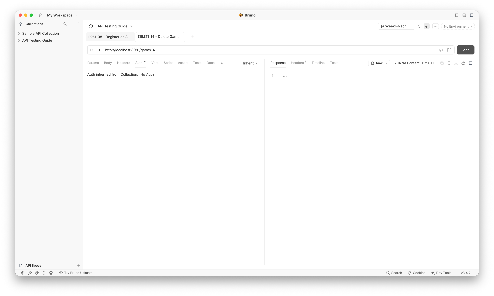
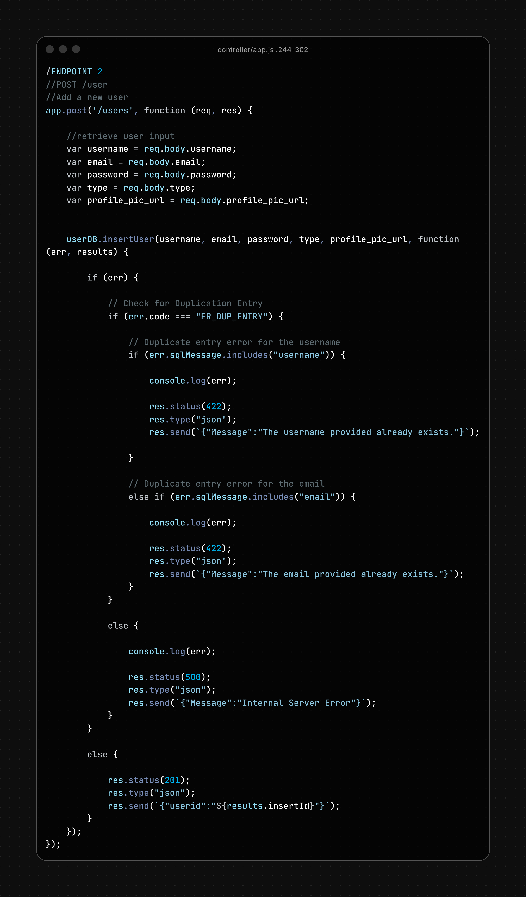
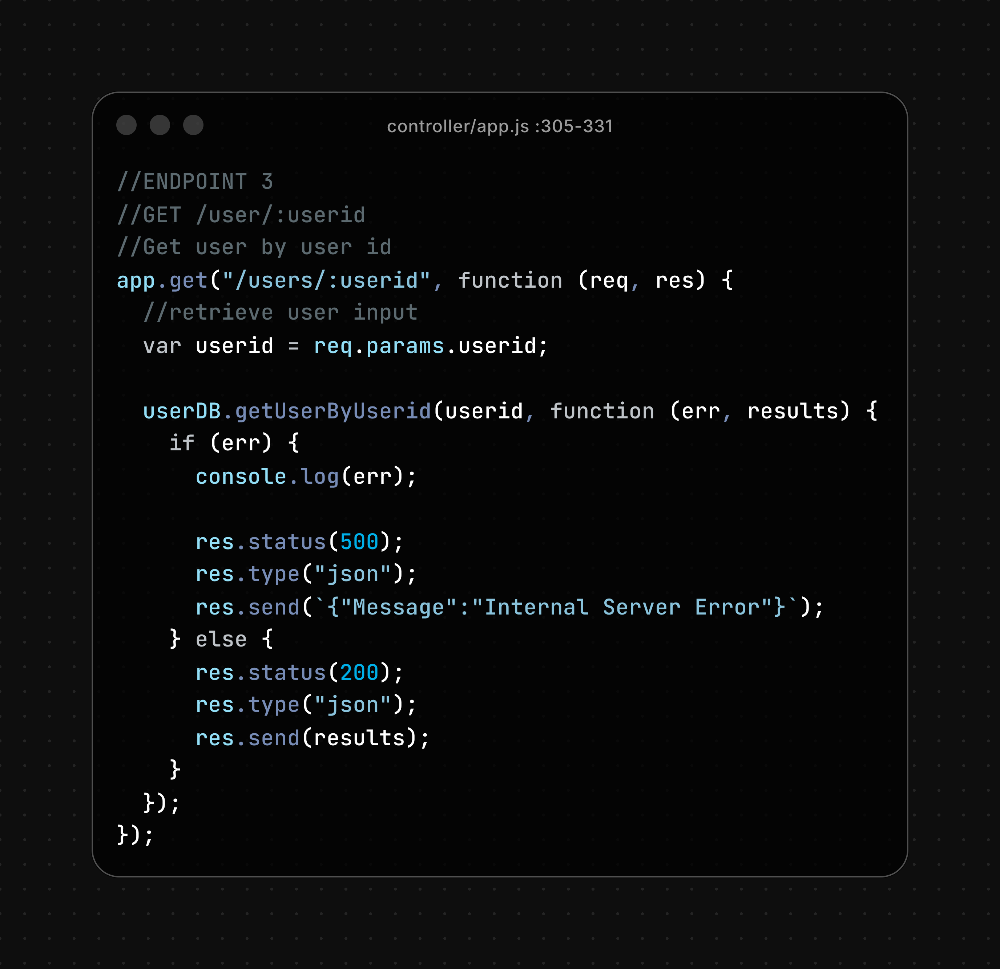
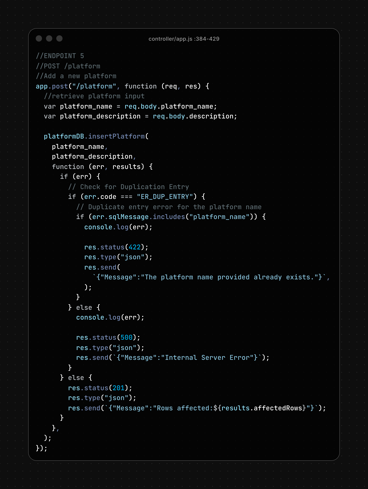
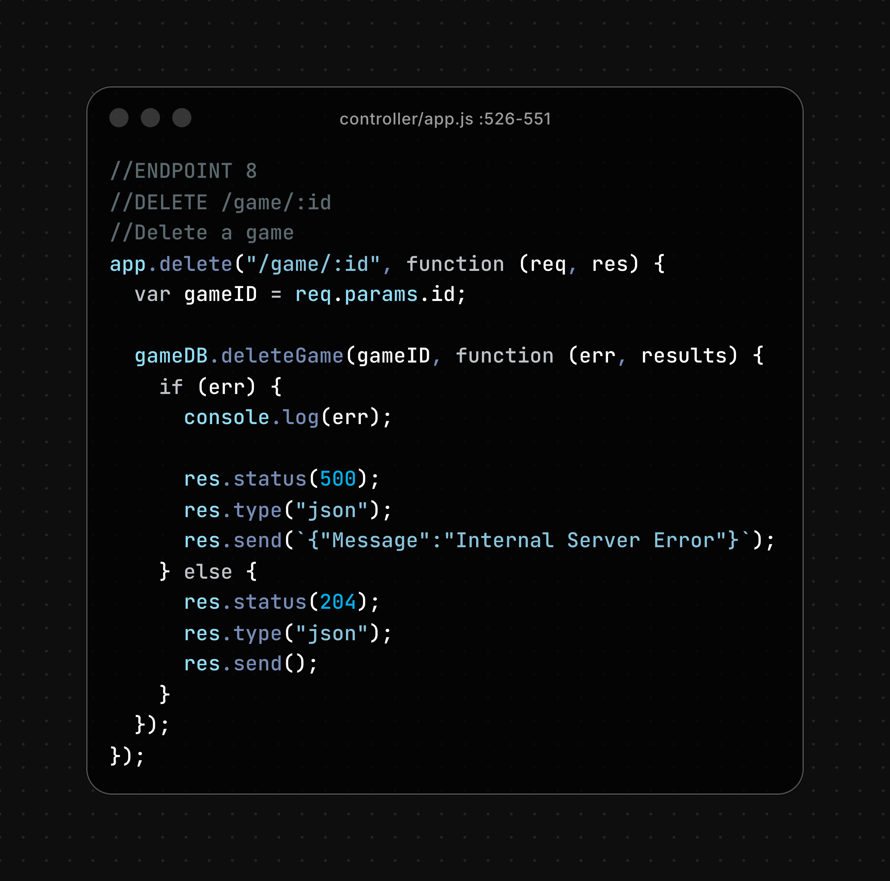
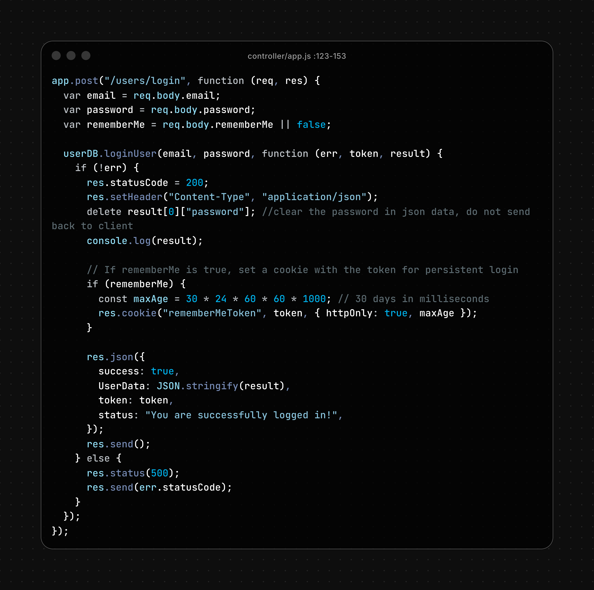
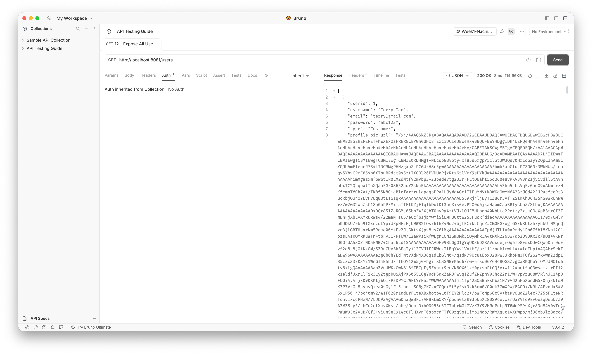
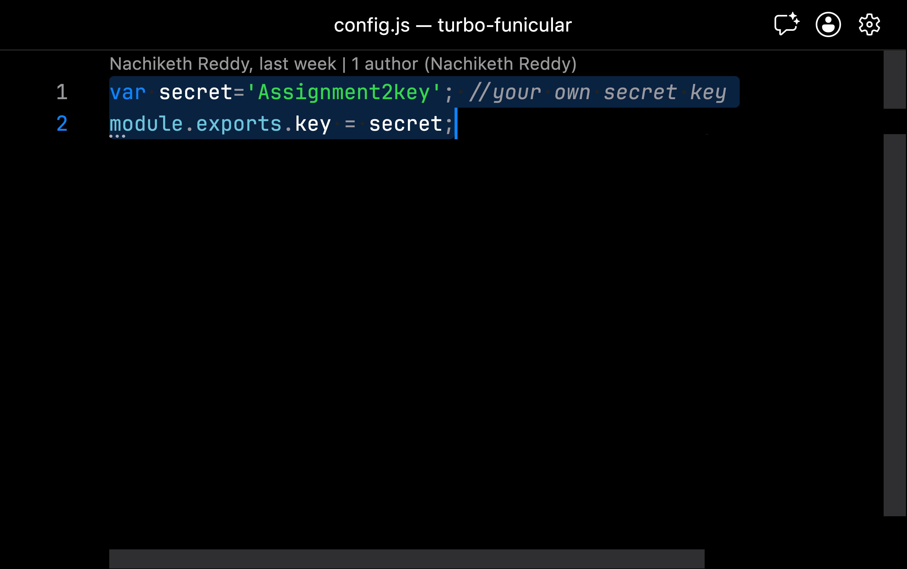

# Security Assessment Report: OWASP A01 — Broken Access Control

---

## 1. Executive Summary

A security assessment of the game catalogue web application (Express.js API on port **8081**, MySQL database `sp_games`, JWT authentication) revealed **four critical-to-high vulnerabilities** under OWASP Top 10 2021 category **A01 — Broken Access Control**. Together, these flaws allowed unauthenticated or low-privilege attackers to administer the entire system, read sensitive credentials, manipulate the database through injection, and forge admin tokens.

| Item | Detail |
|------|--------|
| **Overall risk** | Critical (before remediation) |
| **Impact** | Full confidentiality, integrity, and availability of user accounts, games, categories, platforms, and reviews |
| **Affected components** | `controller/app.js`, `model/users.js`, `model/game.js`, `config.js`, `auth/verifyToken.js` |
| **Remediation status** | Code fixes applied; password hashing and post-fix screenshot evidence still pending |

**Key findings:**

1. **Missing authentication and authorisation** — sensitive CRUD endpoints ran with no server-side access control; admin UI relied on client-side CSS only.
2. **Plaintext password exposure** — `GET /users` returned every user's password in the JSON response; passwords are stored unhashed in MySQL.
3. **SQL injection** — user input was interpolated directly into SQL strings instead of bound parameters.
4. **Hardcoded JWT secret** — the signing key `Assignment2key` was embedded in source code, enabling token forgery.

---

## 2. Assessment Context

| Item | Detail |
|------|--------|
| Backend | `Assignment/BackEndServer` — Express, port **8081** |
| Database | MySQL `sp_games` |
| API testing | Bruno — `API-Testing/opencollection.yml` |
| Test accounts | John (Admin) `John@gmail.com` / `abc123`; Terry (Customer) `terry@gmail.com` / `abc123` |
| Evidence folder | `Assets/Nachiketh/a01/` |

Each finding below follows: vulnerability description → exploitation proof of concept → database impact → vulnerable code → remediation → verification.

---

# Finding 1 — Missing Authentication & Authorisation on API Endpoints

## Vulnerability Description & Flaw Analysis

### Type of Flaw Detected

The application suffers from **Broken Access Control (A01)**. Sensitive API routes — user management, game CRUD, category/platform administration — were registered **without** `verifyToken` or role-checking middleware. Only `/CheckRole` used JWT verification, and no endpoint enforced admin vs customer roles.

The admin dashboard (`admin.html`) applied a CSS `locked` class when the user was not an admin. That is a presentation-layer hint, not a security boundary. Removing the class in browser DevTools restored full interactivity without the server granting access.

Registration also accepted a client-supplied `type` field, so any caller could escalate to `admin` at account creation time.

| Attribute | Value |
|-----------|-------|
| **CVSS 3.1** | 9.8 (Critical) |
| **Vector** | `CVSS:3.1/AV:N/AC:L/PR:N/UI:N/S:U/C:H/I:H/A:H` |

### Mechanism of Action

1. **Unprotected routes:** `GET /users`, `POST /users`, `DELETE /game/:id`, and similar endpoints processed requests with no `Authorization` header check.
2. **Client-trusted roles:** `POST /users` stored whatever `type` value the client sent — including `"admin"`.
3. **Client-side admin gate:** The frontend hid admin controls with CSS; the API never verified the caller's role.

---

## Exploitation Scenario (Proof of Concept)

### Step 1 — Enumerate unprotected endpoints

Using Bruno (`API-Testing/opencollection.yml`), most requests succeeded without an `Authorization` header. The collection exposed the full attack surface: user CRUD, game delete, category/platform create.

```http
GET /users HTTP/1.1
Host: localhost:8081
```

**Expected before fix:** `200 OK` with full user list — no token required.


### Step 2 — Create an admin account without authentication

An attacker registers with an elevated role by supplying `type` in the JSON body:

```http
POST /users HTTP/1.1
Host: localhost:8081
Content-Type: application/json

{
  "username": "hacker",
  "email": "hacker@test.com",
  "password": "hack",
  "type": "admin"
}
```

**Response before fix:** `201 Created` — a new admin account exists with zero authentication.


### Step 3 — Delete a game without authentication

```http
DELETE /game/14 HTTP/1.1
Host: localhost:8081
```

**Response before fix:** `204 No Content` — game row removed from the `game` table.



### Step 4 — Bypass client-side admin lock

1. Open `admin.html` in the browser.
2. Open DevTools → Elements.
3. Remove the `locked` class from the admin container.

The admin UI becomes fully interactive. Any subsequent API call still succeeds because the backend does not enforce role checks.


---

## Database Storage

Without server-side access control, every table was reachable through the API:

| Table | Risk |
|-------|------|
| `users` | Create admin accounts, read all rows |
| `game` | Insert, update, or delete catalogue entries |
| `category`, `platform` | Modify taxonomy data |
| `review` | Post reviews attributed to arbitrary user IDs |

---

## Code Analysis (Vulnerable Pattern → Fix)

**Before:** routes had no middleware.

```javascript
// Vulnerable pattern (original assignment code)
app.get('/users', function (req, res) { /* ... */ });
app.post('/users', function (req, res) {
    var type = req.body.type;  // attacker-controlled role
    /* ... */
});
app.delete('/game/:id', function (req, res) { /* ... */ });
```

**After fix** — `controller/app.js`:

```javascript
var verifyToken = require('../auth/verifyToken.js');
var requireAdmin = require('../auth/requireAdmin.js');

app.get('/users', verifyToken, requireAdmin, function (req, res) { /* ... */ });

app.post('/users', verifyToken, requireAdmin, function (req, res) {
    var type = 'user';  // never trust client-supplied role
    /* ... */
});

app.delete('/game/:id', verifyToken, requireAdmin, function (req, res) { /* ... */ });
```

**New middleware** — `auth/requireAdmin.js`:

```javascript
function requireAdmin(req, res, next) {
    if (String(req.type || '').toLowerCase() !== 'admin') {
        res.status(403);
        return res.json({ auth: false, message: 'Admin access required!' });
    }
    next();
}
```

`verifyToken` decodes the JWT and attaches `req.userid` and `req.type` for downstream checks.

**Vulnerable route registrations** — `controller/app.js` (before fix):















---

## Remediation & Verification

| Test | Before fix | After fix |
|------|------------|-----------|
| `GET /users` — no token | `200` + data | **403** `Not authorized!` |
| `DELETE /game/14` — no token | `204` | **403** |
| `POST /users` with `"type":"admin"` — no token | `201` admin created | **403** |
| `GET /users` — Terry (customer) token | `200` | **403** `Admin access required!` |
| `GET /users` — John (admin) token | `200` | **200** (authorised) |

Post-fix screenshots: save to `Assets/Nachiketh/a01-after/` per [postfix-screenshots guide](../guides/postfix-screenshots.md).

---

# Finding 2 — User Data Exposure with Plaintext Passwords

## Vulnerability Description & Flaw Analysis

### Type of Flaw Detected

**Broken Access Control combined with Sensitive Data Exposure.** The `GET /users` endpoint returned every column from the `users` table, including the `password` field. Passwords are stored and compared as plain strings — no bcrypt or hashing on insert or login.

| Attribute | Value |
|-----------|-------|
| **CVSS 3.1** | 9.1 (Critical) |

### Mechanism of Action

1. **Over-fetching:** The SQL `SELECT` included `password` and the API serialised it into JSON.
2. **No access gate:** Before the A01 fix, any caller could invoke `GET /users`.
3. **Plaintext storage:** Login compared `req.body.password` directly against the database value.

---

## Exploitation Scenario (Proof of Concept)

### Step 1 — Fetch all users with passwords

```http
GET /users HTTP/1.1
Host: localhost:8081
```

**Response before fix (excerpt):**

```json
[
  {
    "userid": 1,
    "username": "Alex",
    "email": "Alex@gmail.com",
    "password": "abc123",
    "type": "user"
  }
]
```


### Step 2 — Reuse exposed credentials

```http
POST /users/login HTTP/1.1
Host: localhost:8081
Content-Type: application/json

{"email":"Alex@gmail.com","password":"abc123"}
```

**Response:** `200 OK` with a valid JWT — account takeover without brute force.




---

## Database Storage

```sql
-- users.password stored as VARCHAR(255), plaintext
INSERT INTO users (username, email, password, type, ...)
VALUES ('Alex', 'Alex@gmail.com', 'abc123', 'user', ...);
```

| Column | Exposure risk |
|--------|---------------|
| `password` | Returned in API JSON; reusable for login |
| `email`, `type` | Supports targeted phishing and privilege mapping |

---

## Code Analysis (Vulnerable Pattern → Fix)

**Before** — `model/users.js`:

```javascript
var getUserSql = `select userid, username, email, password, type, profile_pic_url,
                    DATE_FORMAT(created_at, '%Y-%m-%d %H:%i:%s') AS created_at FROM users`;
```

**After fix** — password removed from all `SELECT` queries; endpoint gated by admin JWT:

```javascript
var getUserSql = `select userid, username, email, type, profile_pic_url,
                    DATE_FORMAT(created_at, '%Y-%m-%d %H:%i:%s') AS created_at FROM users`;
```

```javascript
app.get('/users', verifyToken, requireAdmin, function (req, res) { /* ... */ });
```


**Remaining work:** hash passwords with bcrypt on `insertUser` and use `bcrypt.compare` on login.

---

## Remediation & Verification

| Test | Before fix | After fix |
|------|------------|-----------|
| `GET /users` response shape | Includes `password` key | No `password` field |
| Unauthenticated `GET /users` | `200` | **403** |
| Authenticated admin `GET /users` | Passwords visible | User metadata only |

---

# Finding 3 — SQL Injection in Database Queries

## Vulnerability Description & Flaw Analysis

### Type of Flaw Detected

**Injection (classified under A01 in this assessment).** Original queries built SQL with template-literal interpolation (`${userid}`, `'${title}'`) instead of bound `?` placeholders. The database engine could not distinguish attacker-supplied syntax from intended query structure.

| Attribute | Value |
|-----------|-------|
| **CVSS 3.1** | 9.8 (Critical) |

### Mechanism of Action

1. **String concatenation:** User input became part of the SQL text.
2. **Logic alteration:** Payloads like `1 OR 1=1` broadened `WHERE` clauses.
3. **Error leakage:** Malformed queries triggered `console.log(err)` dumping full `ER_*` messages (also an A09 issue — see [nachiketh-report-a09.md](nachiketh-report-a09.md)).

---

## Exploitation Scenario (Proof of Concept)

### Step 1 — Injection via user ID parameter

```http
GET /users/1%20OR%201=1 HTTP/1.1
Host: localhost:8081
```

**Before fix:** the query became:

```sql
SELECT ... FROM users WHERE userid = 1 OR 1=1;
```

All user rows were returned — including plaintext passwords when the vulnerable `SELECT` still included that column.


### Step 2 — Injection via game creation fields

A crafted `title` in `POST /game` could break out of the SQL string and append arbitrary clauses.

---

## Database Storage

MySQL executed attacker-controlled strings as part of query structure. No separation existed between SQL code and user data at the application layer.

---

## Code Analysis (Vulnerable Pattern → Fix)

**Before** — `model/users.js`:

```javascript
var getUserByUserIDSql = `... FROM users where userid = ${userid};`;
dbConn.query(getUserByUserIDSql, function (err, results) { /* ... */ });
```

**After fix:**

```javascript
var getUserByUserIDSql = `... FROM users where userid = ?;`;
dbConn.query(getUserByUserIDSql, [userid], function (err, results) { /* ... */ });
```

**Before** — `model/game.js`:

```javascript
var insertGameSql = `INSERT INTO game (title, ...) VALUES ('${title}', ...);`;
```

**After fix:**

```javascript
var insertGameSql = `INSERT INTO game (title, game_description, year, game_image) VALUES (?, ?, ?, ?);`;
dbConn.query(insertGameSql, [title, game_description, year, game_image.buffer], ...);
```

The same `?` placeholder pattern was applied across all model files.


---

## Remediation & Verification

| Test | Before fix | After fix |
|------|------------|-----------|
| `GET /users/1 OR 1=1` | All users returned | Empty or single literal match |
| `POST /game` with SQL in `title` | Query manipulation possible | Payload stored as literal string or rejected |
| SQL error in API response | Full query details possible | Generic `Internal Server Error` JSON |

---

# Finding 4 — Hardcoded JWT Signing Secret

## Vulnerability Description & Flaw Analysis

### Type of Flaw Detected

**Cryptographic Failure (A01-related).** The JWT signing key was hardcoded in `config.js` as `Assignment2key`. Anyone with source access — or who guessed the assignment default — could mint valid admin tokens.

| Attribute | Value |
|-----------|-------|
| **CVSS 3.1** | 7.5 (High) |

### Mechanism of Action

1. **Static secret:** `jwt.sign` and `jwt.verify` both used the same embedded string.
2. **Forgery:** An attacker signs arbitrary claims (`userid`, `type: 'admin'`) offline.
3. **Bypass:** Forged tokens pass `verifyToken` and satisfy `requireAdmin`.

---

## Exploitation Scenario (Proof of Concept)

```javascript
const jwt = require('jsonwebtoken');
const forged = jwt.sign(
    { userid: 999, type: 'admin' },
    'Assignment2key',
    { expiresIn: 86400 }
);
```

```http
GET /users HTTP/1.1
Host: localhost:8081
Authorization: Bearer <forged>
```

**Before fix:** `200 OK` — full user list returned under a forged admin identity.


---

## Code Analysis (Vulnerable Pattern → Fix)

**Before** — `config.js`:

```javascript
var secret = 'Assignment2key';
module.exports.key = secret;
```




**After fix:**

```javascript
var secret = process.env.JWT_SECRET;
if (!secret) {
    console.error('FATAL: JWT_SECRET environment variable is not set.');
    process.exit(1);
}
module.exports.key = secret;
```

Set `JWT_SECRET` in `.env` locally and in a secrets manager for production. The server refuses to start if the variable is missing.

---

## Remediation & Verification

| Test | Before fix | After fix |
|------|------------|-----------|
| Token signed with `Assignment2key` | Accepted | **403** when env secret differs |
| Server start without `JWT_SECRET` | Starts normally | **Exits with FATAL error** |

---

## Conclusion

| Finding | Severity | Status |
|---------|----------|--------|
| 1 — Missing auth & authorisation | Critical | Fixed |
| 2 — Plaintext password exposure | Critical | Partially fixed (API); hashing pending |
| 3 — SQL injection | Critical | Fixed |
| 4 — Hardcoded JWT secret | High | Fixed |

**Root cause:** Security controls were absent or client-side only. The API trusted callers and request bodies without verifying identity or role.

**Remaining work:**

- bcrypt password hashing on registration and login
- Post-fix screenshot evidence in `Assets/Nachiketh/a01-after/`
- Rate limiting and account lockout on failed login

**Related report:** [nachiketh-report-a09.md](nachiketh-report-a09.md) — logging, enumeration, and monitoring failures discovered during the same assessment.

---

## Appendix — Evidence Index

All paths relative to repository root.

### Bruno & browser captures (`Assets/Nachiketh/a01/`)

| File | Finding | Description |
|------|---------|-------------|
| `01 -APITesting.png` | 1 | API collection — no auth on most endpoints |
| `09-Admin URLs.png` | 1 | Admin routes visible in collection |
| `11-Brunocancreate an account ad admon.png` | 1 | Register admin without authentication |
| `12-Anyonecandeletegames.png` | 1 | DELETE game without token |
| `10 - Insecure Browser tools.png` | 1 | DevTools CSS bypass on admin UI |
| `02 - ExposedUsersOnPort8001.png` | 2 | GET /users exposes all users |
| `03 - PasswordsUnhashed.png` | 2 | Plaintext passwords in JSON |
| `04 - LogInasAlex.png` | 2 | Login using exposed credentials |
| `05 - ExposedPassword.png` | 2 | Password field visible for Alex |
| `13-Exposure.png` | 2 | Full user record exposure |
| `14-SQL Injection.png` | 3 | SQLi via GET /users/1 OR 1=1 |
| `05.1 - GettingJWT.png` | 4 | Legitimate JWT after login |
| `06 - Changing JWT.png` | 4 | Forging token with known secret |
| `07 - JWTChangeAccepted.png` | 4 | Forged admin token accepted |

### Code captures (`Assets/Nachiketh/a01/code/`)

| File | Finding | Description |
|------|---------|-------------|
| `controller_app.js-_216-241.png` | 1 | GET /users — no middleware |
| `controller_app.js-_244-302.png` | 1 | POST /users — client type |
| `controller_app.js-_305-331.png` | 1 | GET /users/:userid |
| `controller_app.js-_334-381.png` | 1 | POST /category |
| `controller_app.js-_384-429.png` | 1 | POST /platform |
| `controller_app.js-_432-495.png` | 1 | POST /game |
| `controller_app.js-_526-551.png` | 1 | DELETE /game/:id |
| `controller_app.js-_554-582.png` | 1 | POST review — no ownership check |
| `controller_app.js-_123-153.png` | 1 | Login error leakage |
| `model/user.js :28.png` | 2 | SELECT includes password |
| `model/user.js :123-171.png` | 2 | Plaintext login comparison |
| `model/user.js :100-116.png` | 3 | SQLi in getUserByUserid |
| `model/game.js :144-176.png` | 3 | SQLi in insertGame |
| `model/game.js :291-322.png` | 3 | SQLi in updateGame |
| `model/config.js.png` | 4 | Hardcoded JWT secret |
| `model/verify.js.png` | 4 | Token verification uses exposed key |

---

*End of A01 report*
