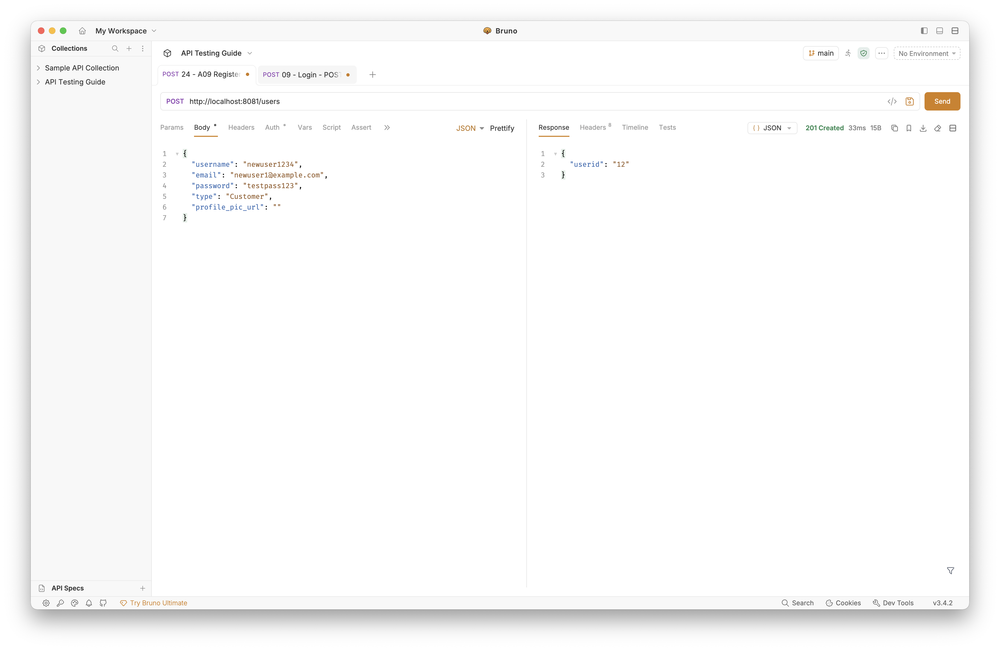
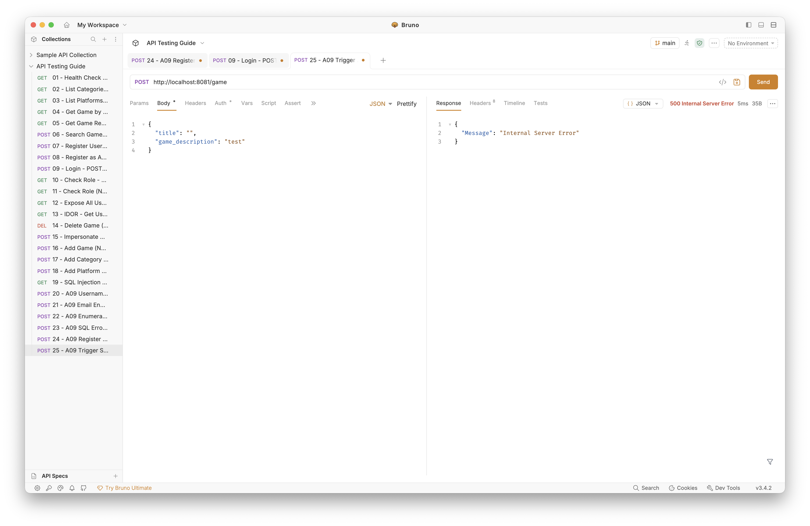
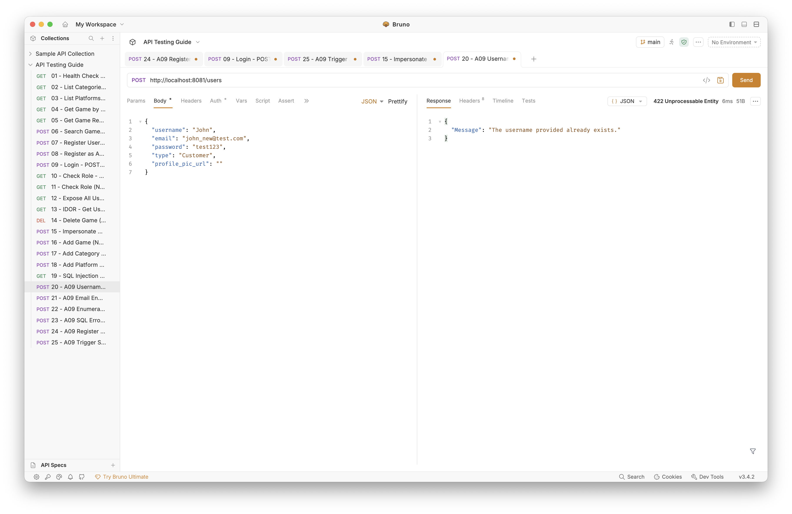
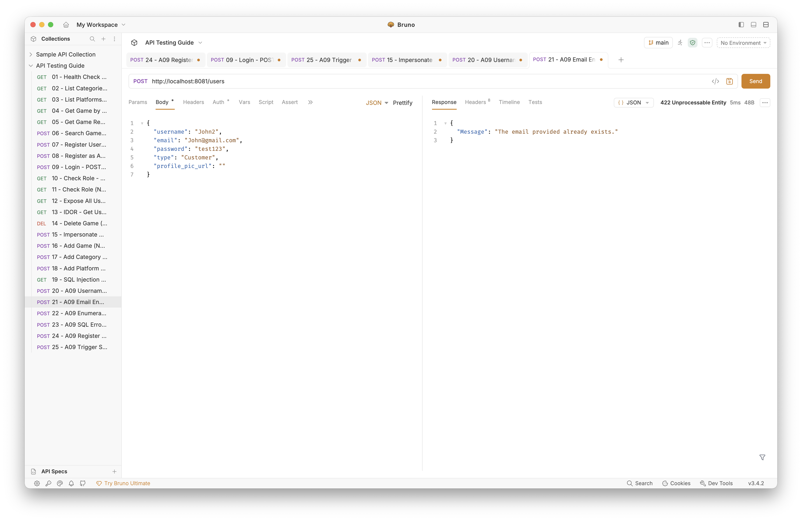
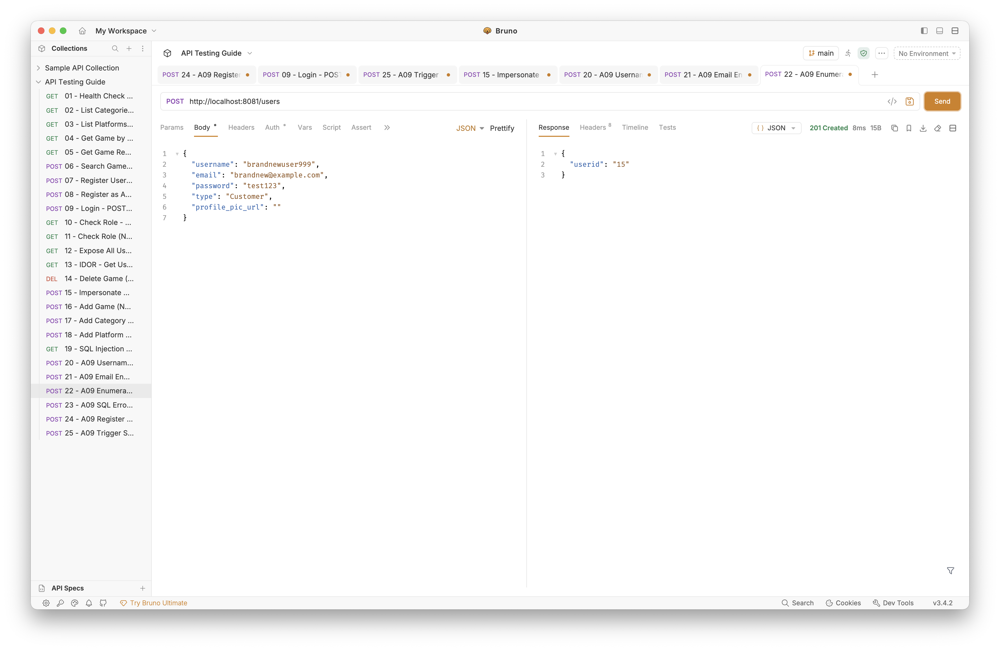
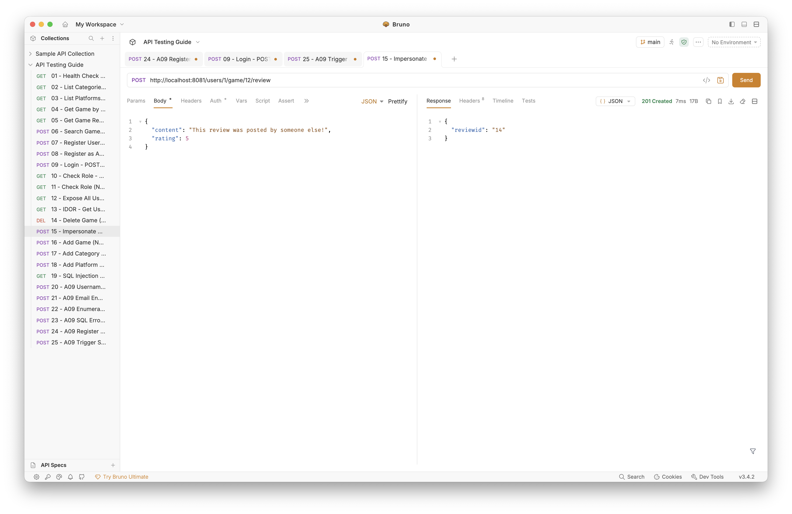
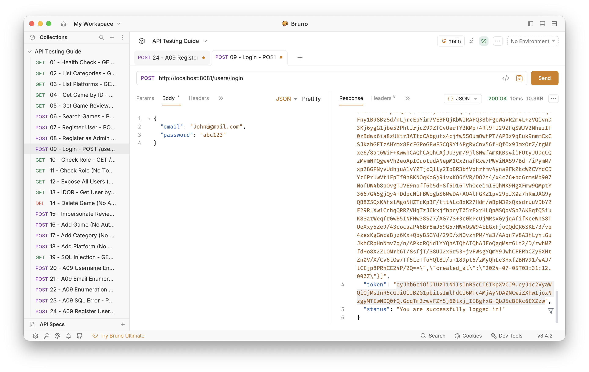

# Vulnerability Analysis Report — OWASP A01 & A09

## Executive Summary

This report documents a security assessment of a **game catalogue web application** (Express.js API on port 8081, MySQL database `sp_games`, JWT authentication). The assessment identified **five critical/high-severity vulnerabilities** across OWASP Top 10 2021 categories **A01 (Broken Access Control)** and **A09 (Security Logging & Monitoring Failures)**.

Work followed a deliberate sequence:

1. **Scout and exploit (before-fix)** — capture evidence with Bruno, browser DevTools, backend terminal, and VS Code.
2. **Remediate A01** — authentication, authorisation, SQL injection, JWT secret, and removal of sensitive `console.log` in `verifyToken.js`.
3. **Remediate A09** — structured audit logging, safe error output, generic duplicate messages, review ownership validation.
4. **Verify (after-fix)** — re-test and capture post-fix screenshots (see [Appendix B](#appendix-b--post-fix-verification-pending)).

**Overall risk:** Critical before remediation. The application is **not production-ready** until password hashing and persistent log storage are implemented.

---

## Assessment Methodology

| Item | Detail |
|------|--------|
| Backend | `Assignment/BackEndServer` — Express, port **8081** |
| Database | MySQL `sp_games` |
| API testing | Bruno — `API-Testing/opencollection.yml` |
| Auth test accounts | John (Admin) `John@gmail.com` / `abc123`; Terry (Customer) `terry@gmail.com` / `abc123` |
| Evidence | `Assets/Nachiketh/` |

Each finding uses the course **7-part structure**: (1) vulnerability, (2) exploitation, (3) database storage, (4) affected code, (5) recommendations, (6) testing, (7) tools.

---

# Part I — OWASP A01: Broken Access Control

> **Status:** Code fixes applied. Before-fix Bruno/browser screenshots belong in `Assets/Nachiketh/a01/` — add these when available. After-fix verification in [Appendix B](#appendix-b--post-fix-verification-pending).

---

## Finding 1 — Missing Authentication & Authorisation on API Endpoints

### 1. Vulnerability & Type of Flaw

**Type:** A01 — Broken Access Control (Missing Authentication & Authorisation)

**CVSS 3.1:** 9.8 (Critical)

The original backend registered sensitive endpoints (user CRUD, game CRUD, category/platform admin) **without** server-side authentication. Only `/CheckRole` used JWT middleware, with no role enforcement elsewhere. The admin dashboard (`admin.html`) relied on a client-side CSS `locked` class — trivially bypassed in DevTools. Registration accepted a client-supplied `type` field, enabling privilege escalation to admin.

### 2. Exploitation

**Step 1 — Enumerate unprotected endpoints**

Using Bruno (`API-Testing/opencollection.yml`), most requests required no `Authorization` header.

<!-- Add when available:  -->

**Step 2 — Create admin account without authentication**

```http
POST /users HTTP/1.1
Content-Type: application/json

{"username":"hacker","email":"hacker@test.com","password":"hack","type":"admin"}
```

Response: `201 Created` — admin account created with no auth.

<!-- Add when available:  -->

**Step 3 — Delete game without authentication**

```http
DELETE /game/14 HTTP/1.1
```

Response: `204 No Content` — game removed from database.

<!-- Add when available:  -->

**Step 4 — Bypass client-side admin lock**

Open `admin.html` → DevTools → remove `locked` class → admin UI becomes interactive without server granting access.

<!-- Add when available:  -->

### 3. Database Storage

Tables `users`, `game`, `category`, `platform`, and `review` were writable without authentication. Any row could be created, read, updated, or deleted through the API.

### 4. Affected Code (with Location)

**File:** `Assignment/BackEndServer/controller/app.js`

Before fix, routes such as `GET /users`, `POST /users`, `DELETE /game/:id` had no middleware. After fix:

```javascript
var verifyToken = require('../auth/verifyToken.js');
var requireAdmin = require('../auth/requireAdmin.js');

app.get('/users', verifyToken, requireAdmin, function (req, res) { /* ... */ });

app.post('/users', verifyToken, requireAdmin, function (req, res) {
    var type = 'user';  // never trust client-supplied role
    /* ... */
});

app.delete('/game/:id', verifyToken, requireAdmin, function (req, res) { /* ... */ });
```

**File:** `Assignment/BackEndServer/auth/requireAdmin.js`

```javascript
function requireAdmin(req, res, next) {
    if (String(req.type || '').toLowerCase() !== 'admin') {
        res.status(403);
        return res.json({ auth: false, message: 'Admin access required!' });
    }
    next();
}
```

<!-- Add when available: code screenshots in Assets/Nachiketh/a01/code/ -->

### 5. Recommendations & Fix Code

- Add `requireAdmin` middleware checking JWT `type` claim.
- Apply `verifyToken` + `requireAdmin` to all admin-only routes.
- Hardcode `type = 'user'` on registration; ignore client `type`.
- Apply `verifyToken` on review route with user-ID ownership check (Finding 5).

### 6. Testing Process

| Test | Before fix | After fix |
|------|------------|-----------|
| `GET /users` no token | 200 + data | **403** `Not authorized!` |
| `DELETE /game/14` no token | 204 | **403** |
| `POST /users` with `"type":"admin"` no token | 201 admin | **403** |
| Same with Customer token | 201 | **403** `Admin access required!` |

**After-fix evidence:** see [Appendix B — A01](#a01-post-fix-assetsnachiketha01-after).

### 7. Tools Used

| Tool | Purpose |
|------|---------|
| Bruno API Client | Craft requests with/without JWT |
| Browser DevTools | Demonstrate client-side-only admin lock |
| VS Code | Identify unprotected route registrations |

---

## Finding 2 — User Data Exposure with Plaintext Passwords

### 1. Vulnerability & Type of Flaw

**Type:** A01 — Broken Access Control / Sensitive Data Exposure

**CVSS 3.1:** 9.1 (Critical)

`GET /users` returned every column including plaintext `password`. Passwords are stored and compared as plain strings in MySQL — no hashing.

### 2. Exploitation

**Step 1 — Fetch all users with passwords**

```http
GET /users HTTP/1.1
```

Response included `"password":"abc123"` for each user.

<!-- Add when available:  -->
<!-- Add when available:  -->

**Step 2 — Reuse exposed credentials**

```http
POST /users/login HTTP/1.1
Content-Type: application/json

{"email":"Alex@gmail.com","password":"<from GET /users>"}
```

Response: `200` with valid JWT.

<!-- Add when available:  -->

### 3. Database Storage

```sql
-- users.password stored as VARCHAR(255), plaintext
INSERT INTO users (..., password, ...) VALUES (..., 'abc123', ...);
```

### 4. Affected Code (with Location)

**File:** `Assignment/BackEndServer/model/users.js` (fixed — password removed from SELECT)

```javascript
var getUserSql = `select userid, username, email, type, profile_pic_url,
                    DATE_FORMAT(created_at, '%Y-%m-%d %H:%i:%s') AS created_at FROM users`;
```

Endpoint now requires admin JWT via `verifyToken, requireAdmin`.

### 5. Recommendations & Fix Code

- Remove `password` from all API SELECT queries.
- Protect `GET /users` with admin authentication.
- **Future:** bcrypt hash on insert; `bcrypt.compare` on login.

### 6. Testing Process

| Test | Before fix | After fix |
|------|------------|-----------|
| `GET /users` response | Includes `password` field | No `password` key |
| Unauthenticated `GET /users` | 200 | **403** |

**After-fix evidence:** [Appendix B — A01](#a01-post-fix-assetsnachiketha01-after)

### 7. Tools Used

| Tool | Purpose |
|------|---------|
| Bruno | Inspect API JSON responses |
| MySQL | Confirm plaintext storage in DB |

---

## Finding 3 — SQL Injection in Database Queries

### 1. Vulnerability & Type of Flaw

**Type:** A01 — Injection (SQLi)

**CVSS 3.1:** 9.8 (Critical)

Original queries built SQL with template-literal interpolation (`${userid}`, `'${title}'`) instead of bound parameters.

### 2. Exploitation

**Step 1 — Injection via user ID**

```http
GET /users/1%20OR%201=1 HTTP/1.1
```

Original query became `WHERE userid = 1 OR 1=1` — returned all users.

**Step 2 — Injection via game fields**

Crafted `title` in `POST /game` could break out of the SQL string.

### 3. Database Storage

MySQL executed attacker-controlled strings as part of the query structure — no separation between code and data.

### 4. Affected Code (with Location)

**File:** `Assignment/BackEndServer/model/users.js` — fixed:

```javascript
var getUserByUserIDSql = `... FROM users where userid = ?;`;
dbConn.query(getUserByUserIDSql, [userid], function (err, results) {
```

**File:** `Assignment/BackEndServer/model/game.js` — fixed:

```javascript
var insertGameSql = `INSERT INTO game (title, game_description, year, game_image) VALUES (?, ?, ?, ?);`;
dbConn.query(insertGameSql, [title, game_description, year, game_image.buffer], ...);
```

### 5. Recommendations & Fix Code

Replace all `${variable}` in SQL with `?` placeholders and pass values in the query array.

### 6. Testing Process

| Test | Before fix | After fix |
|------|------------|-----------|
| `GET /users/1 OR 1=1` | All users returned | Empty/wrong result (literal string) |
| SQL error in console | Full query exposed | Safe JSON error message only |

**After-fix evidence:** [Appendix B — A01](#a01-post-fix-assetsnachiketha01-after)

### 7. Tools Used

| Tool | Purpose |
|------|---------|
| Bruno | Send injection payloads |
| VS Code | Audit all SQL construction |

---

## Finding 4 — Hardcoded JWT Signing Secret

### 1. Vulnerability & Type of Flaw

**Type:** A01 — Cryptographic Failure

**CVSS 3.1:** 7.5 (High)

Original `config.js` contained `var secret='Assignment2key'`. Anyone with source access could forge valid admin JWTs.

### 2. Exploitation

```javascript
const jwt = require('jsonwebtoken');
const forged = jwt.sign({ userid: 999, type: 'admin' }, 'Assignment2key', { expiresIn: 86400 });
// Use: Authorization: Bearer <forged>
```

### 3. Database Storage

Not applicable — signing key is application configuration, not stored in MySQL.

### 4. Affected Code (with Location)

**File:** `Assignment/BackEndServer/config.js` (fixed)

```javascript
var secret = process.env.JWT_SECRET;
if (!secret) {
    console.error('FATAL: JWT_SECRET environment variable is not set.');
    process.exit(1);
}
module.exports.key = secret;
```

### 5. Recommendations & Fix Code

Load secret from environment (`.env` locally; secrets manager in production). Refuse startup if unset.

### 6. Testing Process

| Test | Before fix | After fix |
|------|------------|-----------|
| Token signed with `Assignment2key` | Accepted | **403** if env secret differs |
| Server start without `JWT_SECRET` | Starts | **Exits with FATAL error** |

**After-fix evidence:** [Appendix B — A01](#a01-post-fix-assetsnachiketha01-after)

### 7. Tools Used

| Tool | Purpose |
|------|---------|
| Node.js `jsonwebtoken` | Forge test tokens |
| VS Code | Review config handling |

---

# Part II — OWASP A09: Security Logging & Monitoring Failures

> **Cross-cutting note (A01 ↔ A09):** During A09 scoping, `auth/verifyToken.js` was found to actively log `req.headers` and raw JWT tokens, and `model/users.js` logged tokens. These were **removed in the A01 hardening commit** before A09-specific fixes. Finding 5 below covers the remaining A09 issues: missing audit trails, `console.log(err)` leakage, enumeration messages, and unlogged review impersonation.

---

## Finding 5 — Security Logging & Monitoring Failures

### 1. Vulnerability & Type of Flaw

**Type:** A09 — Security Logging & Monitoring Failures

**CVSS 3.1:** 7.5 (High)

Three distinct issues:

| Issue | Description |
|-------|-------------|
| **No audit logging** | Register, login, delete, and review actions produced no structured forensic record |
| **Information leakage** | `console.log(err)` dumped full SQL errors to stdout; duplicate-registration responses differed for username vs email |
| **Unlogged impersonation** | Any authenticated user could post a review as another user's ID in the URL |

Token/header logging in `verifyToken.js` was remediated under **A01** (see cross-cutting note).

### 2. Exploitation

#### Step 1 — No audit trail on registration

Admin registers a user via `POST /users`. Backend terminal showed only the startup line — no timestamp, actor, or action recorded.




#### Step 2 — SQL error details leaked to console

Malformed `POST /game` triggered a database error. Full `ER_*` message with column names appeared in stdout via `console.log(err)`.




#### Step 3 — Username enumeration

Duplicate registration with an existing username returned a specific message revealing the account exists.




#### Step 4 — Email enumeration

Duplicate registration with an existing email returned a **different** message — confirming the email is registered.




#### Step 5 — Enumeration contrast (new user)

Registering a brand-new username/email returned a different response — proving attackers can distinguish "exists" from "new".



#### Step 6 — Review impersonation without audit trail

Authenticated user posted a review attributed to another user ID in the URL path. No audit entry recorded the action.



#### Step 7 — Auth required after A01 fixes

After A01 remediation, A09 re-testing required a valid admin Bearer token on protected routes.



### 3. Database Storage

Logging gaps are application-layer — not stored in MySQL. However:

- Enumeration responses indirectly confirm rows in `users`.
- SQL errors in stdout reveal `users`, `game` schema details.
- Reviews in `review` table could be inserted with arbitrary `userid` from the URL.

### 4. Affected Code (with Location)

#### Raw error logging — `controller/app.js`

`console.log(err)` appeared in error handlers throughout the file (~22 instances), logging full database error objects to stdout.


#### Enumeration error messages — `controller/app.js`

Different client-facing messages revealed whether username, email, category, or platform already existed.


#### Model-layer logging — `model/users.js`


#### Token logging — `auth/verifyToken.js` (remediated under A01)

Original code actively logged headers and tokens. A commented `//console.log(token)` remained from the assignment template.


### 5. Recommendations & Fix Code

**Fix 1 — Structured audit + safe errors** (`securityLog.js`):

```javascript
function audit(action, detail) {
    console.log(JSON.stringify({
        ts: new Date().toISOString(), level: 'audit', action, detail: detail || {}
    }));
}
function safeError(err) {
    var message = (err && err.message) ? err.message : String(err);
    console.error(JSON.stringify({
        ts: new Date().toISOString(), level: 'error', message: message
    }));
}
```

**Fix 2 — Generic duplicate message** (prevents enumeration):

```javascript
var DUPLICATE_MSG = '{"Message":"The requested resource already exists."}';
// on ER_DUP_ENTRY: res.status(422).send(DUPLICATE_MSG);
```

**Fix 3 — Review ownership check:**

```javascript
if (String(req.userid) !== String(userid)) {
    audit('review_denied', { actor: req.userid, target: userid, gameID: gameID });
    res.status(403);
    return res.json({ auth: false, message: 'Not authorized!' });
}
```

**Fix 4 — Security event audits** on login, registration, game create/delete, review create.

**Already fixed under A01:** removed active `console.log(req.headers)` and `console.log(token)` from `verifyToken.js`.

### 6. Testing Process

| Test | Before fix | After fix |
|------|------------|-----------|
| Register user | Silent terminal | JSON audit: `"action":"user_registered"` |
| Login | No structured log | `"action":"login_success"` / `"login_failed"` |
| Duplicate register | Different username vs email messages | Same generic 422 message |
| SQL error | Full SQL stack in console | JSON `{"level":"error","message":"..."}` only |
| Terry → review as user 3 | 201 Created | **403** + `review_denied` audit |
| verifyToken stdout | Headers/tokens logged | No sensitive output |

**After-fix evidence:** [Appendix B — A09](#a09-post-fix-assetsnachiketha09-after)

### 7. Tools Used

| Tool | Purpose |
|------|---------|
| Bruno API Client | Trigger registration, enumeration, impersonation |
| Backend terminal (stdout) | Observe logging before/after |
| VS Code | Locate logging and enumeration code |
| Git history | Confirm verifyToken fix in A01 commit |

---

## Conclusion

| Finding | Category | Severity | Status |
|---------|----------|----------|--------|
| 1 — Missing Authentication & Authorisation | A01 | Critical | Fixed |
| 2 — Plaintext Password Exposure | A01 | Critical | Partially fixed (API); hashing pending |
| 3 — SQL Injection | A01 | Critical | Fixed |
| 4 — Hardcoded JWT Secret | A01 | High | Fixed |
| 5 — Logging & Monitoring Failures | A09 | High | Fixed |

**Root cause:** Security controls were absent or client-side only; errors and logs were treated as debug output rather than a monitored audit surface.

**Workflow applied:** Remediate **A01** (access control, SQLi, secrets, sensitive auth logging) → assess and fix **A09** (audit trails, safe errors, enumeration, review ownership).

**Remaining work:** bcrypt password hashing; persistent log storage (rotating files / ELK); rate limiting and account lockout on failed login.

---

## Appendix A — Evidence Index (Before-Fix)

All paths relative to repository root.

### A09 — captured (`Assets/Nachiketh/a09/`)

| File | Description |
|------|-------------|
| `24 terminal.png` | No audit log after registration |
| `24.png` | Bruno registration success |
| `25 error.png` | SQL error in terminal |
| `25.png` | Bruno SQL trigger request |
| `username dupe.png` | Username enumeration response |
| `email dupe.png` | Email enumeration response |
| `20.png` | Username enum (Bruno 20) |
| `21.png` | Email enum (Bruno 21) |
| `22.png` | New-user contrast |
| `15.png` | Review impersonation |
| `bearer.png` | Login + Bearer token |
| `code/app 226-228.png` | console.log(err) pattern |
| `code/app 268,278.png` | console.log(err) on duplicates |
| `code/app 272, 282.png` | Enumeration messages |
| `code/app 359.png` | Category enum message |
| `code/app 409.png` | Platform enum message |
| `code/user 131 143 153,154.png` | users.js logging |
| `code/verifyTocken 17.png` | Commented token log |

### A01 — to add (`Assets/Nachiketh/a01/`)

Place your A01 before-fix Bruno/browser/code screenshots here. Expected filenames from scouting:

- `01-APITesting.png`, `10-Insecure-Browser-tools.png`, `11-Brunocancreate an account ad admon.png`, `12-Anyonecandeletegames.png`
- `02-ExposedUsersOnPort8001.png`, `03-PasswordsUnhashed.png`, `04-LogInasAlex.png`
- `code/` — controller and model snippets

---

## Appendix B — Post-Fix Verification (Pending)

Step-by-step guide: [../guides/postfix-screenshots.md](../guides/postfix-screenshots.md)

### A01 post-fix (`Assets/Nachiketh/a01-after/`)

| File | Bruno request | Auth |
|------|---------------|------|
| `403-no-token.png` | **14 - Delete Game** | None |
| `403-register-no-auth.png` | **08 - Register as Admin** | None |
| `200-admin-users.png` | **12 - Expose All Users** | John (admin) |
| `403-customer-token.png` | **12 - Expose All Users** | Terry (customer) |
| `sqli-blocked.png` | **19 - SQL Injection** | John (admin) |

<!-- After capture, embed like:

-->

### A09 post-fix (`Assets/Nachiketh/a09-after/`)

| File | Bruno request | Auth | Capture |
|------|---------------|------|---------|
| `audit-login-terminal.png` | **09 - Login Admin (John)** | — | Terminal |
| `audit-register-terminal.png` | **24 - A09 Register User** | John | Terminal |
| `safe-error-terminal.png` | **25 - A09 Trigger SQL Error** | John | Terminal |
| `generic-duplicate.png` | **20 - A09 Username Enumeration** | John | Bruno |
| `impersonate-blocked.png` | **15 - Impersonate Review** | Terry | Bruno → 403 |

<!-- After capture, embed like:

-->

---

*End of report*
